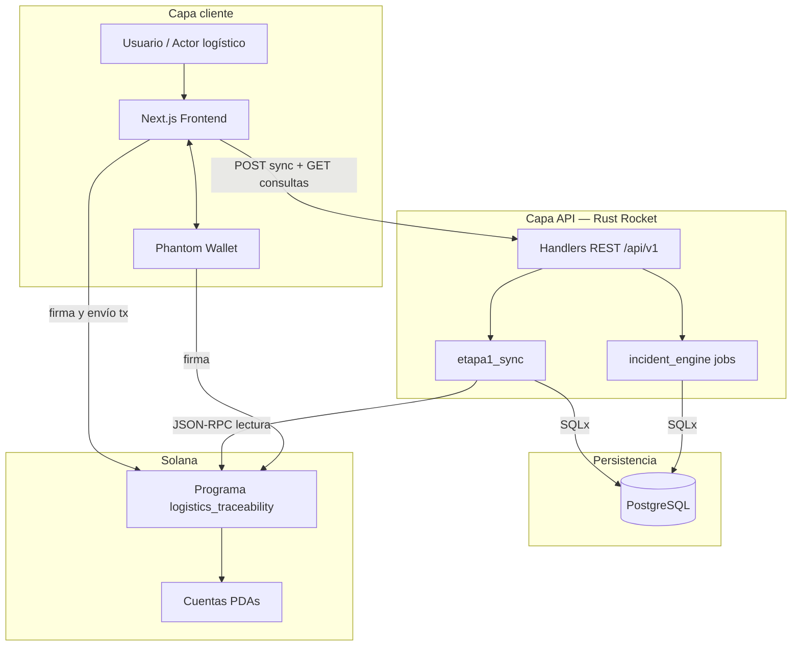
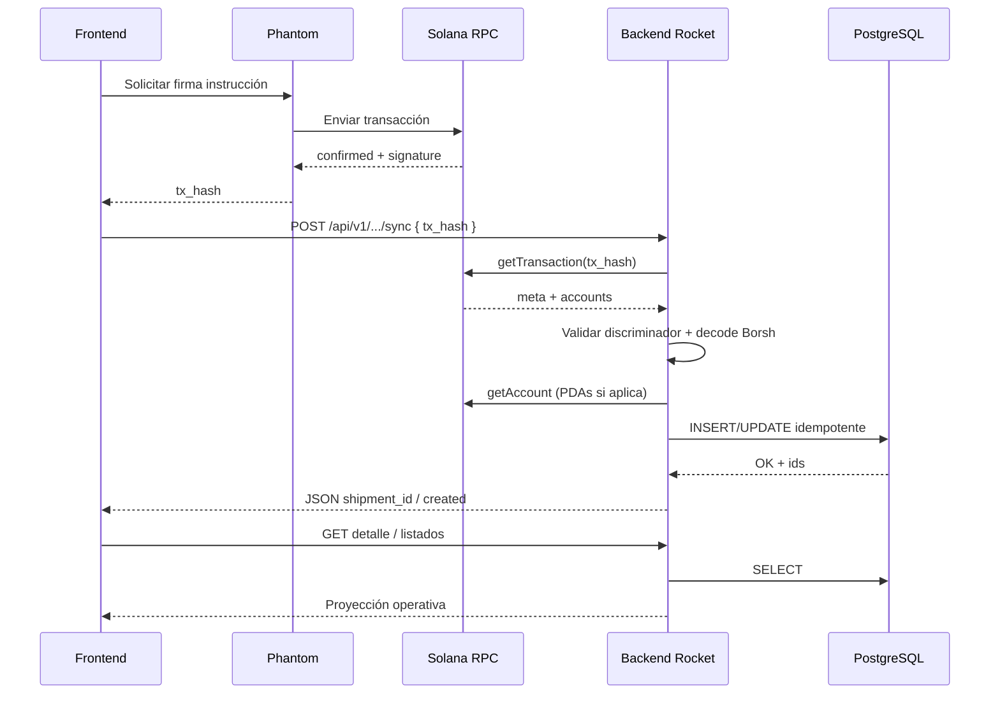
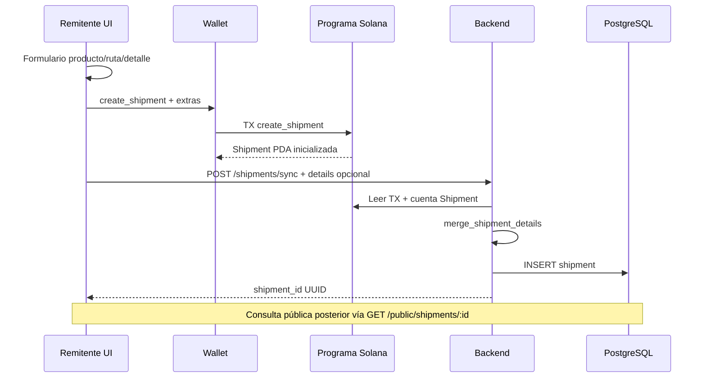

# Arquitectura del sistema — TraceSol Logistics

**Proyecto:** Logistics Trace (TraceSol Logistics)  
**Versión del documento:** 1.0  
**Ámbito:** arquitectura funcional y técnica del monorepo `logistics_trace/`

---

## Tabla de contenidos

1. [Visión general de la plataforma](#1-visión-general-de-la-plataforma)
2. [Principios arquitectónicos](#2-principios-arquitectónicos)
3. [Arquitectura general por capas](#3-arquitectura-general-por-capas)
4. [Responsabilidad de cada componente](#4-responsabilidad-de-cada-componente)
5. [Flujo frontend → wallet → Solana → sync → PostgreSQL](#5-flujo-frontend--wallet--solana--sync--postgresql)
6. [Por qué el backend no firma transacciones](#6-por-qué-el-backend-no-firma-transacciones)
7. [Arquitectura híbrida on-chain / off-chain](#7-arquitectura-híbrida-on-chain--off-chain)
8. [Estrategia de sincronización](#8-estrategia-de-sincronización)
9. [Flujo de eventos](#9-flujo-de-eventos)
10. [Componentes futuros](#10-componentes-futuros)
11. [Diagramas Mermaid](#11-diagramas-mermaid)
12. [Estrategia de escalabilidad futura](#12-estrategia-de-escalabilidad-futura)
13. [Observabilidad y monitoreo](#13-observabilidad-y-monitoreo)
14. [Consideraciones enterprise](#14-consideraciones-enterprise)
15. [Conclusión técnica](#15-conclusión-técnica)

---

## 1. Visión general de la plataforma

**TraceSol Logistics** es una plataforma de **trazabilidad logística** que combina operación diaria (paneles, mapas, telemetría, incidencias) con **evidencia verificable en Solana**. Los actores de la cadena (remitente, transportista, hub, destinatario, inspector) registran hechos relevantes mediante transacciones firmadas en cliente; el estado contractual y los contadores críticos viven on-chain; el backend materializa ese estado en **PostgreSQL** para consultas rápidas, reglas automáticas y experiencia de usuario rica (timeline, mapa, hub de incidencias).

### Capacidades implementadas (MVP+)

| Dominio | On-chain | Off-chain (API + BD) |
|---------|----------|----------------------|
| Gobierno del programa | `initialize` → `ProgramConfig` | Consola de activación (solo autoridad cuando el programa ya está activo) |
| Actores | `register_actor` | Catálogo de roles, listados Carrier/Recipient |
| Envíos | `create_shipment`, `assign_carrier`, estados | Detalles operativos (peso, ETA, prioridad, notas), listados filtrados por wallet |
| Eventos logísticos | `record_checkpoint` | Timeline, transiciones de estado derivadas, mapa de recorrido |
| Incidencias críticas | `report_critical_incident` | Motor de reglas, severidad, resolución, anclaje on-chain desde UI |
| Consulta pública | Lectura vía RPC (frontend) + API pública | `GET /api/v1/public/shipments/:id` sin autenticación de wallet |
| Telemetría | — | Muestreo, simuladores de demo, reglas (frío, humedad, retraso, GPS) |

La **blockchain es la fuente de verdad** para identidad de actores, existencia de envíos, secuencia de checkpoints autorizados, asignación de transportista e incidencias críticas registradas en el programa. PostgreSQL es la **proyección operativa** indexada para la aplicación.

---

## 2. Principios arquitectónicos

| Principio | Descripción |
|-----------|-------------|
| **Cliente firma, servidor verifica** | Toda mutación de estado contractual pasa por Phantom (o wallet compatible) en el navegador. El backend nunca posee clave de operador. |
| **Sync post-confirmación** | Tras `confirmed` en RPC, el frontend invoca `POST /api/v1/*/sync` con `tx_hash`. El backend re-lee la transacción y las cuentas afectadas. |
| **Idempotencia por transacción** | Los servicios de sync comprueban `tx_hash` / cuentas ya persistidas para evitar duplicados en reintentos. |
| **Separación lectura/escritura** | Escritura on-chain + sync; lectura masiva desde PostgreSQL y catálogos. |
| **Defensa en profundidad** | Validación de discriminadores de instrucción, programa, PDAs y datos Borsh en backend antes de persistir. |
| **Off-chain enriquecido** | Metadata de checkpoint, telemetría, reglas de incidencia y campos operativos extensos no replican byte a byte la cadena. |
| **Transparencia pública acotada** | Endpoint público de detalle de envío sin exponer operaciones de escritura. |

---

## 3. Arquitectura general por capas

```text
┌─────────────────────────────────────────────────────────────────────────┐
│  Capa de presentación                                                    │
│  Next.js (App Router) · TypeScript · CSS TraceSol · componentes React    │
│  Phantom Wallet · WalletSession · instrucciones Solana serializadas      │
└───────────────────────────────┬─────────────────────────────────────────┘
                                │ HTTPS (REST JSON)
                                ▼
┌─────────────────────────────────────────────────────────────────────────┐
│  Capa de aplicación / API                                                │
│  Rust · Rocket · CORS · handlers · DTO · repos · domain services           │
│  etapa1_sync · incident_engine (jobs tokio) · access por wallet query    │
└───────────────┬─────────────────────────────┬───────────────────────────┘
                │ SQLx                         │ JSON-RPC (solo lectura)
                ▼                              ▼
┌───────────────────────────┐   ┌───────────────────────────────────────┐
│  PostgreSQL                │   │  Solana (Anchor program)               │
│  Catálogos · envíos ·      │   │  logistics_traceability                │
│  checkpoints · incidents · │   │  ProgramConfig · Actor · Shipment ·    │
│  telemetry · rules         │   │  Checkpoint · CriticalIncident         │
└───────────────────────────┘   └───────────────────────────────────────┘
```

### Repositorio monorepo

| Ruta | Rol |
|------|-----|
| `infra/` | Docker Compose — PostgreSQL local |
| `programs/logistics_traceability/` | Programa Anchor (`logistics_traceability`) |
| `backend/` | API Rocket + motor de incidencias |
| `frontend/` | UI Next.js |
| `docs/` | Documentación del proyecto (este conjunto) |

Integración Git por componente: ramas `infra`, `solana/anchor`, `backend`, `frontend` → merge `--no-ff` a `main`.

---

## 4. Responsabilidad de cada componente

### 4.1 Frontend (Next.js + TypeScript)

- **Rutas operativas:** `/panel`, `/admin`, registro de actores, creación de envíos, checkpoints, incidencias críticas, asignación de transportista.
- **Consulta pública:** `/envios`, `/envios/[shipmentId]` — rail de ciclo logístico, mapa, timeline sin wallet obligatoria.
- **Consola:** `/consola` — salud del sistema, activación del programa (`initialize`), visibilidad restringida a la wallet autoridad cuando `ProgramConfig` ya existe.
- **Construcción de transacciones:** `instructions.ts` / `ix.ts` — codificación alineada con discriminadores del programa.
- **Confirmación:** `confirmSerializedTx` contra `NEXT_PUBLIC_SOLANA_RPC_URL`.
- **Proyección local:** parseo camelCase de API, timeline de viaje, mapa (`JourneyRouteMap`), flujo de incidencias críticas y pérdida (`Lost`).

### 4.2 Backend (Rust + Rocket + SQLx)

- **Sync Etapa 1:** validación de `tx_hash`, fetch de transacción, localización de instrucción del programa, decodificación Borsh de cuentas, persistencia transaccional.
- **Consultas:** envíos (filtro por wallet en rutas autenticadas), checkpoints, incidencias, telemetría, hub de incidencias.
- **API pública:** detalle de envío + incidencias + reconciliación de estado `Lost` cuando aplica.
- **Catálogos:** roles, tipos de checkpoint, estados, productos, ubicaciones, tipos de incidencia.
- **Motor de incidencias (`incident_engine`):** workers periódicos (telemetría simulada en demo, evaluación de reglas, creación de incidencias automáticas off-chain), matriz de severidad, *gating* por fase logística.
- **Sin firma:** cliente RPC HTTP de solo lectura (`SolanaRpcClient`).

### 4.3 Programa Solana (Anchor)

Instrucciones expuestas en `logistics_traceability`:

| Instrucción | Propósito |
|-------------|-----------|
| `initialize` | Crea `ProgramConfig`; fija `authority` al firmante |
| `register_actor` | Alta de actor con rol, nombre, ubicación |
| `create_shipment` | Envío con producto, ruta, frío, detalles compactos on-chain |
| `assign_carrier` | Remitente asigna transportista registrado (una vez) |
| `record_checkpoint` | Evento logístico con geo/temperatura/humedad/metadata |
| `cancel_shipment` | Cancelación por remitente en estados abiertos |
| `confirm_delivery` | Confirmación de entrega por destinatario |
| `report_critical_incident` | Incidencia crítica + hash de evidencia; tipo `Lost` → estado `Lost` |

### 4.4 PostgreSQL

- Proyección relacional normalizada con catálogos (`cat_*`), tablas de dominio (`shipments`, `checkpoints`, `incidents`, telemetría, reglas).
- Migraciones versionadas aplicadas al arranque del backend.
- Soporte a consultas analíticas, hub de incidencias y motor off-chain sin coste de RPC por lectura UI.

### 4.5 Infraestructura local

- `docker compose` para Postgres; variables alineadas entre `.env` (backend) y `.env.local` (frontend).

---

## 5. Flujo frontend → wallet → Solana → sync → PostgreSQL

Secuencia típica de una operación de escritura (ej. crear envío):

1. **UI** recoge datos (formulario operativo + parámetros de instrucción).
2. **Wallet** (`WalletSession` + Phantom) conecta y expone la clave pública del firmante.
3. **Frontend** construye `TransactionInstruction`(s), solicita firma y envía a la red configurada (`localnet` / `devnet`).
4. **RPC Solana** confirma la transacción; el cliente obtiene `signature` (base58).
5. **Frontend** llama `POST /api/v1/shipments/sync` con `{ tx_hash, details? }` (detalles off-chain opcionales en snake_case).
6. **Backend** obtiene la transacción, verifica que contiene la instrucción esperada (`create_shipment`), decodifica la cuenta `Shipment`, fusiona detalles on-chain/off-chain, inserta filas en Postgres.
7. **Frontend** refresca listados/detalle vía `GET /api/v1/shipments` o detalle por id.

El mismo patrón aplica a:

- `POST /api/v1/actors/sync`
- `POST /api/v1/shipments/assign-carrier/sync`
- `POST /api/v1/checkpoints/sync`
- `POST /api/v1/incidents/sync`

---

## 6. Por qué el backend no firma transacciones

| Razón | Implicación |
|-------|-------------|
| **Modelo de confianza** | El firmante on-chain es prueba de intención del actor; delegar firma al servidor concentraría riesgo y rompería no repudio. |
| **Custodia** | Almacenar claves en el API convertiría el backend en billetera caliente — inaceptable en entornos logísticos regulados. |
| **Alineación Solana** | El programa valida firmantes y PDAs por instrucción; el servidor no puede sustituir al `sender`, `carrier` o `recipient` exigidos. |
| **Auditoría** | Exploradores y `tx_hash` vinculan operación UI ↔ cadena ↔ fila Postgres vía hash de creación/sync. |
| **Implementación actual** | `HttpSolanaRpcClient` solo implementa lectura (`get_transaction`, `get_account`). No hay módulo de keypair operativo en `backend/`. |

El backend **sí** orquesta lógica off-chain (reglas, resolución de incidencias automáticas, telemetría), pero **no** sustituye la firma del participante en hechos contractuales.

---

## 7. Arquitectura híbrida on-chain / off-chain

### On-chain (datos de compromiso)

- Identificadores y contadores globales (`ProgramConfig`).
- Roles y wallets de actores.
- Estado del envío (`ShipmentStatus`: Created, InTransit, AtHub, OutForDelivery, Delivered, Returned, Cancelled, Lost).
- Conteo de checkpoints e incidencias; wallet del carrier asignado.
- Campos compactos: peso en gramos, cantidad, unidad, ETA unix, referencia, prioridad, notas truncadas, hash de evidencia en incidencias críticas.

### Off-chain (datos operativos y analíticos)

- Detalles extendidos de envío en columnas JSON/relacionales (`estimated_delivery_at`, notas largas vía sync).
- Checkpoints con metadata rica, temperatura/humedad para UI y reglas.
- Incidencias automáticas del motor (`source: auto`) con `evidence_json`, reglas, severidad calculada.
- Telemetría serie temporal para simulación y reglas (frío, humedad, retraso, desvío).
- Catálogos de productos, ubicaciones y umbrales.

### Fusión en sync

`merge_shipment_details` prioriza valores on-chain y rellena huecos con el cuerpo HTTP del cliente, manteniendo coherencia cuando el programa no almacena todos los campos del formulario.

---

## 8. Estrategia de sincronización

### Contrato HTTP

- Entrada mínima: `{ "tx_hash": "<base58>" }`.
- Variantes: `details` en creación de envío; `commitment` opcional.
- Salida: ids internos (UUID), ids on-chain, flags `created: false` en replay idempotente.

### Pasos internos (servicio `etapa1_sync`)

1. Validar formato de firma y configuración `PROGRAM_ID`.
2. `get_transaction` con commitment configurado.
3. Fallar con `TxNotFound` si la transacción no está confirmada o no existe.
4. Localizar instrucción por discriminador (ej. `create_shipment_ix`).
5. Resolver cuentas PDAs y `get_account` + decode Borsh.
6. Transacción SQL: insert/update en repos, actualizar estado derivado (ej. tras checkpoint o incidencia `Lost`).
7. Disparar evaluación del motor (`MonitoringService`) cuando corresponde.

### Reconciliación operativa

- Ejemplo: `reconcile_lost_status` alinea `shipments.status = Lost` si existe incidencia de pérdida (`Lost` / `SHIPMENT_LOST`) — en lectura pública/privada y migraciones de backfill.

### Errores y reintentos

- El frontend usa helpers de reintento en sync (`postSyncWithRetry`) ante fallos transitorios.
- Mensajes de usuario centralizados (`etapa1UserMessages`) para desalineación programa/red/wallet.

---

## 9. Flujo de eventos

### 9.1 Eventos de dominio logístico (checkpoints)

| Tipo (catálogo) | Efecto típico |
|-----------------|---------------|
| Pickup, Transit, HubIn, HubOut, DeliveryAttempt | Avance operativo; backend puede actualizar `shipments.status` vía `shipment_status_transition` |
| Delivered | Cierre de ciclo |
| SensorData | Telemetría / alimentación de reglas (off-chain) |

### 9.2 Eventos on-chain (Anchor)

El programa emite eventos Anchor (módulo `events`) consumibles por indexadores futuros; hoy el **indexado principal** es pull por `tx_hash` en sync.

### 9.3 Eventos del motor de incidencias (off-chain)

Con `INCIDENT_ENGINE_ENABLED=true` (config):

- Tareas periódicas tokio (intervalos ~20–45 s) recorren envíos activos.
- Simuladores de telemetría (entorno demo) alimentan reglas.
- `RuleEngineService` evalúa condiciones (cadena de frío, humedad, retraso, offline, ruta).
- `incident_processor` persiste incidencias automáticas; UI permite **anclar** en cadena incidencias críticas pendientes de `tx_hash`.

### 9.4 Eventos de UI

- Wallet conectada / rol desde `GET /api/v1/actors/me?wallet=`.
- Timeline mezcla checkpoints + incidencias críticas filtradas.
- Estado visual de pérdida en rail (`is-loss`) cuando hay incidencia o estado `Lost`.

---

## 10. Componentes futuros

Lo siguiente está **parcialmente implementado** o diseñado como evolución; la documentación lo separa del MVP estable.

| Componente | Estado actual | Dirección futura |
|------------|---------------|------------------|
| **Incident Intelligence Engine** | Módulo `incident_engine` con reglas, severidad, jobs, simuladores | Indexación event-driven real, ingestión IoT, menos simulación |
| **Arquitectura event-driven** | Sync pull por transacción | Cola (NATS/Kafka), indexador de slots, webhooks |
| **IoT / telemetría** | Tablas + simuladores periódicos | Conectores MQTT/HTTP, validación de dispositivo, retención TS |
| **Indexador dedicado** | Backend hace decode en sync | Microservicio que escucha `logsSubscribe` y publica proyecciones |
| **Identidad enterprise** | Wallet = identidad | SSO + vínculo wallet opcional, RBAC por organización |

---

## 11. Diagramas Mermaid

### 11.1 Arquitectura general



### 11.2 Flujo de sincronización



### 11.3 Flujo de creación de envío



---

## 12. Estrategia de escalabilidad futura

| Dimensión | Enfoque recomendado |
|-----------|---------------------|
| **Lecturas** | Réplicas de lectura Postgres, caché HTTP para consulta pública, CDN para frontend estático |
| **Escrituras on-chain** | Priorización de cuentas, batching donde el programa lo permita, cola de firmas en cliente |
| **Sync** | Indexador asíncrono desacoplado del request HTTP; el POST sync devuelve 202 + job id |
| **RPC Solana** | Pool de endpoints, fallback, commitment explícito, rate limit por tenant |
| **Motor de incidencias** | Sharding por `shipment_id`, reglas como plugins, backpressure en ingestión IoT |
| **Multi-red** | `ProgramConfig` por cluster; configuración por entorno en despliegue |

El diseño actual (stateless API + Postgres + cliente firma) escala horizontalmente el **tier HTTP** con relativa facilidad; el cuello de botella tenderá a **RPC Solana** y **volumen de transacciones**, no al backend en lectura.

---

## 13. Observabilidad y monitoreo

| Área | Implementación / recomendación |
|------|--------------------------------|
| **Salud API** | `GET /health` (estado + DB), `GET /api/v1/solana/health` (RPC) |
| **Consola UI** | Dashboard en `/consola` para operador de red |
| **Logs** | `tracing` / salida estándar en Rocket; correlación por `tx_hash` en sync |
| **Métricas (futuro)** | Latencia sync, tasa de `TxNotFound`, incidencias auto vs críticas ancladas |
| **Cadena** | Explorador Solana por `creation_tx_hash` / firmas en UI |
| **Alertas** | Umbrales en motor de incidencias + integración SIEM vía webhook off-chain |

---

## 14. Consideraciones enterprise

- **Seguridad:** CORS restringido (`CORS_ALLOWED_ORIGINS`), sin custodia de claves en servidor, validación estricta de `PROGRAM_ID` y discriminadores.
- **Cumplimiento:** Trazabilidad inmutable en cadena para hechos críticos; Postgres para retención y reporting con políticas de borrado off-chain definidas por contrato.
- **DR:** Backups Postgres, documentación de redeploy del programa (nuevo `program id` implica migración de cliente), RPO/RTO según SLA.
- **Entornos:** Separación `localnet` / `devnet` / `mainnet-beta` con variables en `.env` / `.env.local`.
- **Acceso:** Rutas autenticadas por query `wallet`; consola restringida a autoridad on-chain tras activación; consulta pública sin datos sensibles de actores (wallets enmascaradas en API).
- **Evolución del contrato:** Versionado del programa Anchor; sync tolerante a campos opcionales en detalles off-chain.

---

## 15. Conclusión técnica

TraceSol Logistics implementa una **arquitectura híbrida deliberada**: Solana ancla la confianza y el orden de los hechos logísticos contractuales; PostgreSQL y el API Rocket ofrecen **velocidad, consultas y automatización** (motor de incidencias, mapas, telemetría). El frontend cierra el ciclo con **firma local** y sync explícito.

Ese reparto — **firmar en cliente, verificar en servidor, leer en BD** — es adecuado para trazabilidad enterprise en ecosistemas Web3: minimiza custodia, maximiza auditabilidad y mantiene una ruta clara hacia indexación event-driven e **Incident Intelligence Engine** completo sin rediseñar el núcleo on-chain ya desplegado.

---

## Referencias en el repositorio

| Documento / módulo | Ubicación |
|------------------|-----------|
| README principal | `../README.md` |
| Backend API | `../backend/README.md` |
| Frontend rutas | `../frontend/README.md` |
| Programa Anchor | `../programs/logistics_traceability/README.md` |
| Infra Postgres | `../infra/README.md` |

---

*Documento 01 de la serie de documentación en `docs/`.*
