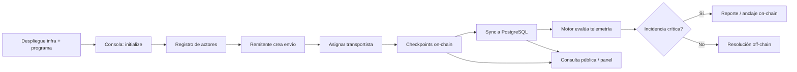
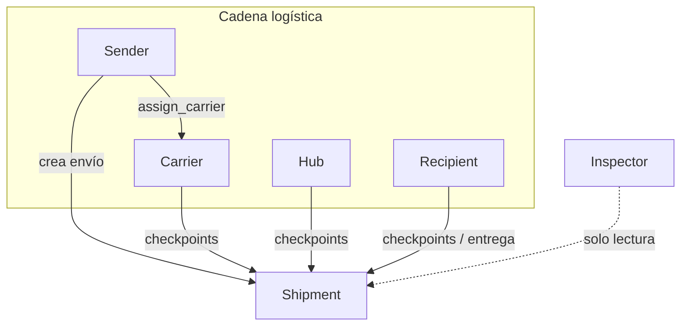
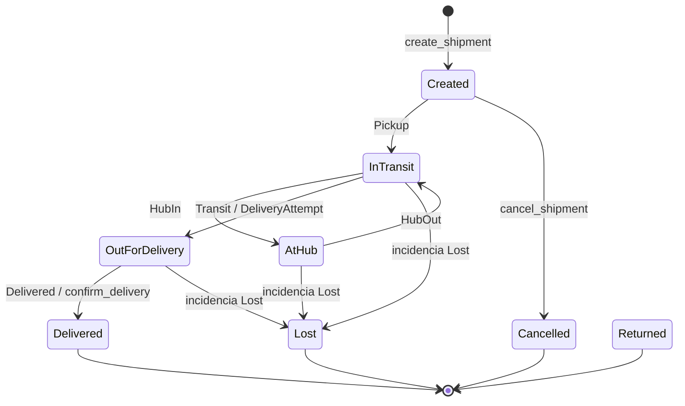
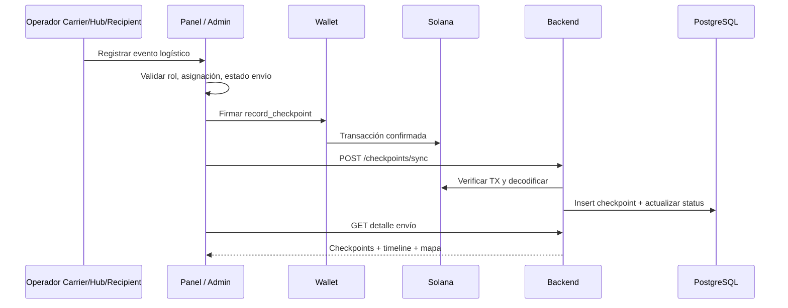
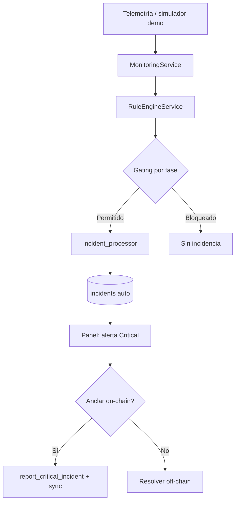
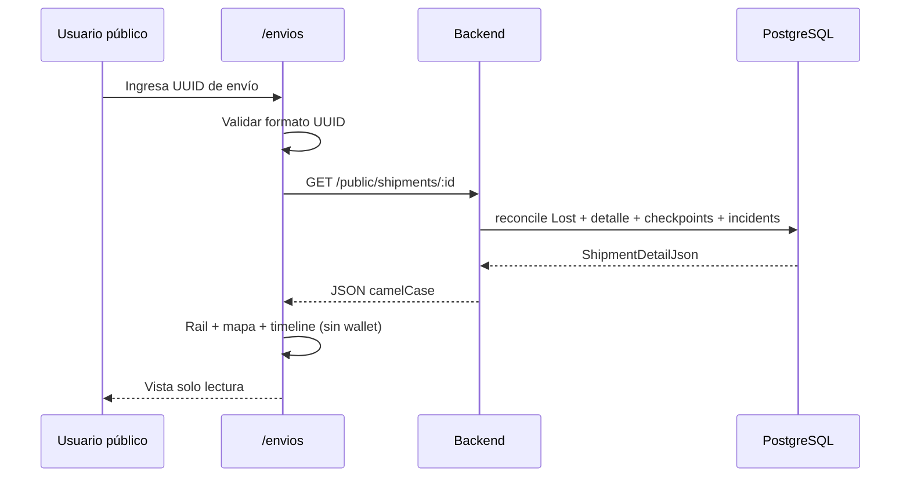

# Especificación funcional — TraceSol Logistics

**Proyecto:** Logistics Trace (TraceSol Logistics)  
**Versión del documento:** 1.0  
**Ámbito:** comportamiento funcional de la plataforma según implementación actual  
**Documento relacionado:** [01_SYSTEM_ARCHITECTURE.md](./01_SYSTEM_ARCHITECTURE.md)

---

## Tabla de contenidos

1. [Objetivo del sistema](#1-objetivo-del-sistema)
2. [Problema que resuelve](#2-problema-que-resuelve)
3. [Flujo general de operación](#3-flujo-general-de-operación)
4. [Descripción de módulos](#4-descripción-de-módulos)
5. [Roles del sistema](#5-roles-del-sistema)
6. [Capacidades y restricciones por rol](#6-capacidades-y-restricciones-por-rol)
7. [Ciclo de vida del shipment](#7-ciclo-de-vida-del-shipment)
8. [Estados del shipment](#8-estados-del-shipment)
9. [Tipos de checkpoints](#9-tipos-de-checkpoints)
10. [Flujo funcional de trazabilidad](#10-flujo-funcional-de-trazabilidad)
11. [Flujo funcional de incidencias automáticas](#11-flujo-funcional-de-incidencias-automáticas)
12. [Casos de uso principales](#12-casos-de-uso-principales)
13. [Reglas de negocio importantes](#13-reglas-de-negocio-importantes)
14. [Validaciones funcionales](#14-validaciones-funcionales)
15. [Flujo de consulta pública](#15-flujo-de-consulta-pública)
16. [Objetivos de auditoría y trazabilidad](#16-objetivos-de-auditoría-y-trazabilidad)
17. [Roadmap funcional futuro](#17-roadmap-funcional-futuro)

---

## 1. Objetivo del sistema

TraceSol Logistics permite **registrar, seguir y auditar envíos logísticos** con participación de múltiples actores (remitente, transportista, hub, destinatario, inspector), dejando **hechos críticos anclados en Solana** y una **capa operativa** (PostgreSQL + API) para consultas, mapas, telemetría y detección automática de incidencias.

Objetivos funcionales concretos:

| Objetivo | Descripción |
|----------|-------------|
| **Trazabilidad verificable** | Cada checkpoint e incidencia crítica relevante puede vincularse a una transacción on-chain. |
| **Operación multi-actor** | Cada rol ejecuta las acciones que le corresponden con su wallet. |
| **Transparencia controlada** | Consulta pública de un envío sin exponer operaciones de escritura. |
| **Alertas operativas** | Motor off-chain evalúa telemetría y condiciones de negocio; incidencias críticas pueden anclarse en cadena. |
| **Continuidad off-chain** | Detalles extendidos (ETA, peso, notas, metadata) y hub de incidencias en base de datos. |

---

## 2. Problema que resuelve

En cadenas logísticas tradicionales suele faltar:

- Un **registro único y no repudiable** de quién registró cada evento.
- **Visibilidad compartida** entre remitente, transportista y destinatario sin depender solo de un TMS cerrado.
- **Evidencia ante disputas** (retraso, daño, ruptura de frío, pérdida).
- Un canal **público de consulta** para clientes o auditores externos.

La plataforma aborda esto combinando:

1. **Contrato Solana** — estados, contadores, permisos de firma.
2. **Backend de proyección** — listados, filtros por rol, reglas, telemetría.
3. **Interfaz unificada** — panel operativo, admin, consulta pública y consola de red.

---

## 3. Flujo general de operación

### Secuencia recomendada (entorno desarrollo)

| Paso | Actor / módulo | Acción |
|------|----------------|--------|
| 1 | Operador infra | PostgreSQL + validador Solana + deploy Anchor |
| 2 | Admin red | `/consola` — `initialize` (wallet conectada) |
| 3 | Cualquier rol | `/registro` — `register_actor` + sync |
| 4 | Sender | Crear envío (`create_shipment` + sync con detalles) |
| 5 | Sender | Asignar Carrier (`assign_carrier` + sync) |
| 6 | Carrier / Hub / Recipient | `record_checkpoint` + sync |
| 7 | Sistema / usuario | Incidencias automáticas; anclaje crítico si aplica |
| 8 | Público | `/envios/[uuid]` — consulta sin firma |

---

## 4. Descripción de módulos

### 4.1 Registro de actores

**Rutas:** `/registro`  
**On-chain:** `register_actor(role, name, location)`  
**Off-chain:** `POST /api/v1/actors/sync` con `tx_hash`

| Aspecto | Comportamiento |
|---------|----------------|
| **Entrada** | Rol (catálogo), nombre, ubicación; wallet Phantom como firmante |
| **Salida** | Actor en PDA; fila en Postgres; rol disponible en `GET /actors/me?wallet=` |
| **Precondición** | Programa inicializado en la red configurada |
| **Postcondición** | La misma wallet puede operar según su rol en panel y admin |

Si el validador local se reinicia, el actor puede existir en Postgres pero no en cadena; la UI indica **re-registro** con la misma wallet.

---

### 4.2 Creación de envíos

**Rutas:** panel `/panel`, admin `/admin` (formulario crear envío)  
**On-chain:** `create_shipment` (producto, origen, destino, frío, peso, cantidad, ETA unix, referencia, prioridad, notas)  
**Off-chain:** `POST /api/v1/shipments/sync` con `details` opcional (peso, cantidad, ETA ISO, prioridad, notas extendidas)

| Aspecto | Comportamiento |
|---------|----------------|
| **Quién** | Solo rol **Sender** (remitente firmante = wallet del envío) |
| **Destinatario** | Wallet Recipient seleccionada de catálogo backend |
| **Estado inicial** | `Created` on-chain y en Postgres |
| **Detalles** | Fusión on-chain + cuerpo sync (`merge_shipment_details`) |

---

### 4.3 Registro de checkpoints

**Rutas:** detalle de envío en panel/admin — modal registrar evento  
**On-chain:** `record_checkpoint(tipo, ubicación, geo, temperatura, humedad, metadata)`  
**Off-chain:** `POST /api/v1/checkpoints/sync`

| Aspecto | Comportamiento |
|---------|----------------|
| **Quién** | Carrier, Hub, Recipient (no Sender ni Inspector en UI) |
| **Carrier** | Solo envíos donde `carrier_wallet` = su wallet |
| **Efecto estado** | Backend actualiza `shipments.status` según tipo de checkpoint (subconjunto MVP) |
| **SensorData** | Evento de telemetría; no siempre cambia estado logístico principal |

---

### 4.4 Consulta pública

**Rutas:** `/envios` (búsqueda), `/envios/[shipmentId]` (detalle)  
**API:** `GET /api/v1/public/shipments/:id` (sin query `wallet`)

| Aspecto | Comportamiento |
|---------|----------------|
| **Autenticación** | No requiere wallet |
| **Identificador** | UUID de servicio (no id on-chain numérico) |
| **Contenido** | Resumen, rail de ciclo logístico, mapa, timeline, incidencias críticas visibles |
| **Escritura** | Ninguna; solo lectura |

---

### 4.5 Panel operativo

**Rutas:** `/panel`, `/panel/envios`, detalle por envío  
**API:** `GET /api/v1/shipments?wallet=` con filtrado por rol

| Rol | Vista de inventario |
|-----|---------------------|
| Sender / Recipient | Envíos donde participan (sender o recipient wallet) |
| Carrier | Envíos con `carrier_wallet` = su wallet |
| Hub / Inspector | Inventario operativo completo |

Incluye: timeline con incidencias críticas, mapa de recorrido, acciones de checkpoint, asignación de transportista (Sender), reporte de incidencia crítica, bloqueo tras pérdida registrada.

---

### 4.6 Incident Intelligence Engine

**Ubicación:** módulo `incident_engine` en backend (habilitado con `INCIDENT_ENGINE_ENABLED`)  
**UI:** hub `/admin` incidencias, anclaje on-chain desde detalle de envío

| Capa | Función |
|------|---------|
| **Ingesta** | Telemetría en tablas; simuladores periódicos en entorno demo |
| **Reglas** | Cadena de frío, humedad, retraso, sensor offline, desvío de ruta |
| **Gating** | No detectar tras pérdida; solo tras pickup / en tránsito según regla |
| **Severidad** | Matriz en BD (`incident_rules` + `severity.rs`) |
| **Salida** | Incidencias `source: auto` en Postgres; severidad Critical en trazabilidad UI |
| **Anclaje** | Usuario firma `report_critical_incident`; sync persiste `tx_hash` |

No sustituye el juicio humano: permite **detectar**, **resolver off-chain** y **anclar** lo crítico en Solana.

---

## 5. Roles del sistema

Roles definidos en catálogo y programa (`ActorRole`):

| Rol | Código | Participación típica |
|-----|--------|----------------------|
| **Remitente** | `Sender` | Crea envíos, asigna transportista, puede reportar incidencias críticas |
| **Transportista** | `Carrier` | Checkpoints de recogida/tránsito/hub; incidencias en envíos asignados |
| **Hub** | `Hub` | Checkpoints HubIn/HubOut; inventario global |
| **Destinatario** | `Recipient` | Entrega / intento de entrega; confirmación operativa |
| **Inspector** | `Inspector` | Solo lectura operativa; sin firma on-chain en panel |

---

## 6. Capacidades y restricciones por rol

### Matriz de capacidades (implementación actual)

| Capacidad | Sender | Carrier | Hub | Recipient | Inspector |
|-----------|:------:|:-------:|:---:|:---------:|:---------:|
| Registrar actor | ✓ | ✓ | ✓ | ✓ | ✓ |
| Crear envío | ✓ | — | — | — | — |
| Asignar transportista | ✓ | — | — | — | — |
| Registrar checkpoint logístico | — | ✓* | ✓ | ✓ | — |
| Inventario completo | — | — | ✓ | — | ✓ |
| Ver envíos propios / asignados | ✓ | ✓* | ✓ | ✓ | ✓ |
| Reportar incidencia crítica on-chain | ✓ | ✓* | — | ✓ | — |
| Resolver incidencia off-chain | ✓ | ✓ | ✓ | ✓ | — |
| Operaciones firma en panel | ✓ | ✓ | ✓ | ✓ | — |

\* Carrier: solo si está **asignado** al envío (`carrier_wallet` coincide).

### Restricciones transversales

| Restricción | Aplica a |
|------------|----------|
| Wallet conectada | Acciones de escritura y listados autenticados |
| Actor on-chain verificado | Checkpoints, asignación, incidencias |
| Programa configurado (`PROGRAM_ID`) | Toda operación de sync |
| Envío terminal (`Delivered`, `Cancelled`, `Returned`, `Lost`) | No nuevos checkpoints; no nuevas incidencias on-chain |
| Pérdida registrada | Bloqueo de motor y de reporte/anclaje adicional en UI |
| Inspector | Sin navegación de operaciones on-chain en panel |

### Guía de tipos de checkpoint por rol (UI)

| Rol | Tipos sugeridos en formulario |
|-----|-------------------------------|
| Carrier | Pickup, Transit, HubIn, HubOut, SensorData |
| Hub | HubIn, HubOut, SensorData |
| Recipient | DeliveryAttempt, Delivered, SensorData |

> El programa Anchor **no restringe por rol** el tipo de checkpoint; la guía es validación de experiencia y operación. El backend y la UI aplican las reglas de negocio descritas.

---

## 7. Ciclo de vida del shipment

### Fases funcionales

| Fase | Descripción |
|------|-------------|
| **Planificación** | Envío creado; opcionalmente sin transportista |
| **Asignación** | Sender asigna Carrier una sola vez |
| **Ejecución** | Checkpoints y telemetría; cambios de estado derivados |
| **Excepción** | Incidencias automáticas o críticas manuales |
| **Cierre** | Entregado, cancelado, devuelto o perdido |
| **Consulta** | Público o participantes revisan historial |

---

## 8. Estados del shipment

### Catálogo operativo (`cat_shipment_status`)

| Estado | Código | Significado funcional |
|--------|--------|------------------------|
| Creado | `Created` | Envío registrado; puede asignar carrier |
| En tránsito | `InTransit` | Salió de origen (p. ej. tras Pickup) |
| En hub | `AtHub` | En nodo intermedio |
| En reparto | `OutForDelivery` | Preparado / en reparto |
| Entregado | `Delivered` | Ciclo completado |
| Devuelto | `Returned` | Excepción de devolución |
| Cancelado | `Cancelled` | Anulado por remitente |
| Pérdida | `Lost` | Pérdida registrada (on-chain o reconciliación por incidencia) |

### Transiciones por checkpoint (MVP)

| Estado actual | Checkpoint | Nuevo estado |
|---------------|------------|--------------|
| Created | Pickup | InTransit |
| InTransit | HubIn | AtHub |
| AtHub | HubOut | InTransit |
| InTransit | Transit | OutForDelivery |
| InTransit | DeliveryAttempt | OutForDelivery |
| * (no terminal) | Delivered | Delivered |
| — | Lost (incidencia) | Lost |

Estados terminales **bloquean** nuevos checkpoints e incidencias on-chain.

---

## 9. Tipos de checkpoints

| Código | Etiqueta | Uso funcional |
|--------|----------|---------------|
| `Pickup` | Recogida | Inicio del transporte desde origen |
| `HubIn` | Entrada hub | Llegada a nodo logístico |
| `HubOut` | Salida hub | Salida de nodo |
| `Transit` | Tránsito | Movimiento entre nodos |
| `DeliveryAttempt` | Intento entrega | Reparto sin cierre definitivo |
| `Delivered` | Entregado | Cierre logístico |
| `SensorData` | Datos sensor | Telemetría / lecturas (no siempre cambia estado principal) |

### Datos asociados a un checkpoint

| Campo | Obligatorio | Notas |
|-------|:-----------:|-------|
| Tipo | Sí | Catálogo alineado on-chain |
| Ubicación | Sí | Texto o referencia catálogo |
| Latitud / longitud | No | Enteros escalados on-chain |
| Temperatura / humedad | No | Alimentan reglas de incidencia |
| Metadata | No | JSON operativo off-chain enriquecido en sync |
| Actor | Sí | Wallet firmante |

---

## 10. Flujo funcional de trazabilidad

### Representación en UI

| Elemento | Fuente de datos |
|----------|-----------------|
| **Rail de ciclo** | Estado + checkpoints + incidencias críticas (pérdida resaltada) |
| **Timeline** | Checkpoints logísticos + incidencias severidad Critical |
| **Mapa** | Origen/destino + puntos de ruta derivados de checkpoints |
| **Métricas** | Peso, cantidad, ETA, prioridad, participantes enmascarados |

La trazabilidad **pública** usa el mismo modelo visual con API pública y sin acciones de escritura.

---

## 11. Flujo funcional de incidencias automáticas

### Reglas automáticas (MVP)

| Regla | Condición funcional resumida |
|-------|------------------------------|
| **Cold chain** | Frío requerido o umbrales de producto; tras pickup; en tránsito |
| **Humidity** | Límites de humedad del producto; en tránsito |
| **Delay** | Sin checkpoint logístico reciente en ventana configurada |
| **Sensor offline** | Sin telemetría reciente con control térmico activo |
| **Route deviation** | Desvío GPS respecto a corredor esperado (InTransit / AtHub / OutForDelivery) |

### Gating global del motor

| Condición | Efecto |
|-----------|--------|
| `has_registered_loss` | No nuevas detecciones automáticas |
| Sin pickup y estado `Created` | Reglas de tránsito limitadas |
| Estado terminal | Sin monitoreo activo |
| Pérdida / cancelación / entrega | Cierre de detección |

### Incidencias críticas on-chain (manuales)

Tipos alineados con programa: `TempViolation`, `Damage`, `Delay`, `Lost`, `Unauthorized`, `Other`.  
Severidad on-chain: `High`, `Critical`.  
Reportadores permitidos on-chain: **sender**, **recipient**, **carrier asignado**.

Tipo **Lost** → estado del envío pasa a **Lost** y bloquea operaciones posteriores.

---

## 12. Casos de uso principales

| ID | Caso de uso | Actor principal | Resultado |
|----|-------------|-----------------|-----------|
| UC-01 | Activar programa en red | Admin consola | `ProgramConfig` activo; authority = wallet |
| UC-02 | Registrar actor logístico | Cualquier rol | Actor on-chain + Postgres |
| UC-03 | Crear envío con detalle operativo | Sender | Shipment `Created` + UUID servicio |
| UC-04 | Asignar transportista | Sender | `carrier` en cuenta Shipment |
| UC-05 | Registrar recogida | Carrier | Checkpoint Pickup → `InTransit` |
| UC-06 | Registrar paso por hub | Hub / Carrier | HubIn / HubOut |
| UC-07 | Confirmar entrega | Recipient | Delivered + fecha entrega |
| UC-08 | Consultar envío públicamente | Visitante | Detalle solo lectura |
| UC-09 | Supervisar inventario | Hub / Inspector | Listado completo |
| UC-10 | Detectar ruptura de frío | Sistema (motor) | Incidencia auto + posible anclaje |
| UC-11 | Declarar pérdida | Sender / Carrier / Recipient | Incidencia Lost + estado Lost |
| UC-12 | Resolver incidencia operativa | Participante / Hub | Estado resuelto en Postgres |
| UC-13 | Cancelar envío abierto | Sender | `Cancelled` on-chain |

---

## 13. Reglas de negocio importantes

| # | Regla |
|---|--------|
| RN-01 | Un envío tiene un único remitente y un único destinatario on-chain. |
| RN-02 | El transportista se asigna **una vez** y solo el remitente puede hacerlo. |
| RN-03 | El Carrier solo opera envíos donde su wallet es el `carrier` asignado. |
| RN-04 | No se registran checkpoints en envíos entregados, cancelados o devueltos. |
| RN-05 | Tras **pérdida registrada**, no hay nuevas incidencias on-chain ni detección automática. |
| RN-06 | La blockchain prevalece en estado contractual; Postgres se sincroniza post-TX. |
| RN-07 | Reintento de sync con el mismo `tx_hash` es idempotente. |
| RN-08 | Solo incidencias **Critical** aparecen en la trazabilidad visual principal. |
| RN-09 | Hub e Inspector ven todos los envíos; Sender/Recipient solo los suyos. |
| RN-10 | Consola de activación, con programa ya activo, solo visible para wallet `authority`. |
| RN-11 | Consulta pública identifica envíos por **UUID de servicio**, no por wallet. |
| RN-12 | Detalles operativos extensos pueden enviarse en sync aunque el programa almacene versión compacta. |

---

## 14. Validaciones funcionales

### Registro y programa

| Validación | Mensaje / comportamiento esperado |
|------------|-----------------------------------|
| Programa no desplegado | Enlace a consola; sync devuelve 503 si `PROGRAM_ID` ausente |
| Wallet no conectada | Acciones deshabilitadas; “Conecte la wallet” |
| Actor no en cadena | Indicación de re-registro en `/registro` |

### Envíos

| Validación | Criterio |
|------------|----------|
| Rol crear envío | Solo Sender |
| Recipient válido | Selección de catálogo backend |
| Peso / cantidad | Rangos positivos en formulario sync |
| ETA | Formato fecha; persistencia coherente con día calendario |

### Checkpoints

| Validación | Criterio |
|------------|----------|
| Rol | Carrier, Hub o Recipient |
| Asignación Carrier | `carrier_wallet` = viewer |
| Estado envío | No terminal |
| Campos geo/temp | Tipos numéricos válidos si se informan |

### Incidencias

| Validación | Criterio |
|------------|----------|
| Reporte on-chain | Participante autorizado; envío no cerrado |
| Pérdida duplicada | UI bloquea nuevo reporte si ya hay Lost |
| Resolución | Rol distinto de Inspector |
| Anclaje auto | Incidencia auto sin `tx_hash` y elegible según `canAnchorAutoIncident` |

### Consulta pública

| Validación | Criterio |
|------------|----------|
| UUID | Formato UUID v4 de servicio |
| Existencia | 404 / mensaje si no existe en Postgres |

---

## 15. Flujo de consulta pública

### Alcance de información pública

| Dato | Visible | Notas |
|------|:-------:|-------|
| Producto, origen, destino | ✓ | |
| Estado y ETA | ✓ | Etiquetas localizadas |
| Checkpoints | ✓ | Sin acciones de edición |
| Incidencias críticas | ✓ | Filtradas por severidad en UI |
| Wallets participantes | Parcial | Enmascaradas en API (`mask_wallet`) |
| Telemetría cruda | Limitado | Según exposición en detalle público actual |
| Acciones de firma | — | No disponibles |

---

## 16. Objetivos de auditoría y trazabilidad

| Objetivo | Mecanismo |
|----------|-----------|
| **Integridad** | Hashes de transacción (`creation_tx_hash`, `tx_hash` por checkpoint/incidencia) |
| **No repudio** | Firmante registrado on-chain por instrucción |
| **Cronología** | `occurred_at` / timestamps unix + orden en timeline |
| **Evidencia crítica** | `evidence_hash` en incidencia on-chain + `evidence_json` off-chain |
| **Estado acordado** | Estado Shipment en programa + reconciliación Lost en lectura |
| **Terceros** | Consulta pública + explorador Solana por signature |
| **Operación interna** | Hub de incidencias, historial de resolución en Postgres |

### Preguntas que el sistema permite responder

1. ¿Quién creó el envío y cuándo?  
2. ¿Qué eventos logísticos se registraron y en qué orden?  
3. ¿Hubo ruptura de frío o retraso detectado automáticamente?  
4. ¿Se declaró pérdida y quién firmó la incidencia?  
5. ¿Coincide el estado en base de datos con la cuenta on-chain?

---

## 17. Roadmap funcional futuro

| Prioridad | Iniciativa | Beneficio |
|-----------|------------|-----------|
| Alta | Ingesta IoT real (MQTT/HTTP) | Sustituir simuladores demo |
| Alta | Indexador de eventos Solana | Sync en tiempo real sin depender del cliente |
| Media | RBAC organizacional (empresa → wallets) | Multi-tenant enterprise |
| Media | Notificaciones (email/webhook) ante Critical | Respuesta operativa más rápida |
| Media | Inspector con informes exportables | Auditoría formal PDF/CSV |
| Baja | Devolución (`Returned`) con flujo UI completo | Excepciones logísticas |
| Baja | SLA y ventanas de entrega contractuales | KPIs automáticos |
| Baja | Integración ERP/WMS | Orquestación externa |

El **Incident Intelligence Engine** evolucionará de reglas periódicas en Postgres a un modelo **event-driven** con colas, manteniendo el anclaje crítico on-chain como capa de prueba.

---

## Glosario breve

| Término | Definición |
|---------|------------|
| **Shipment** | Unidad de trazabilidad (envío) con id on-chain y UUID servicio |
| **Checkpoint** | Evento logístico firmado en cadena |
| **Sync** | Proyección de una transacción confirmada hacia PostgreSQL |
| **Incidencia auto** | Generada por motor off-chain (`source: auto`) |
| **Incidencia crítica** | Severidad Critical; puede anclarse on-chain |
| **Authority** | Wallet que ejecutó `initialize` del programa |

---

## Referencias

| Recurso | Ubicación |
|---------|-----------|
| Arquitectura del sistema | [01_SYSTEM_ARCHITECTURE.md](./01_SYSTEM_ARCHITECTURE.md) |
| README operativo | [../README.md](../README.md) |
| Capacidades UI | `frontend/src/lib/panel/capabilities.ts` |
| Reglas de acceso envíos | `backend/src/access/mod.rs` |

---

*Documento 02 de la serie de documentación en `docs/`.*
