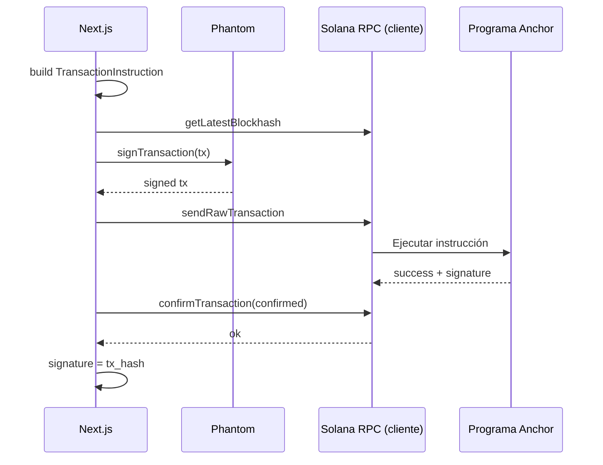
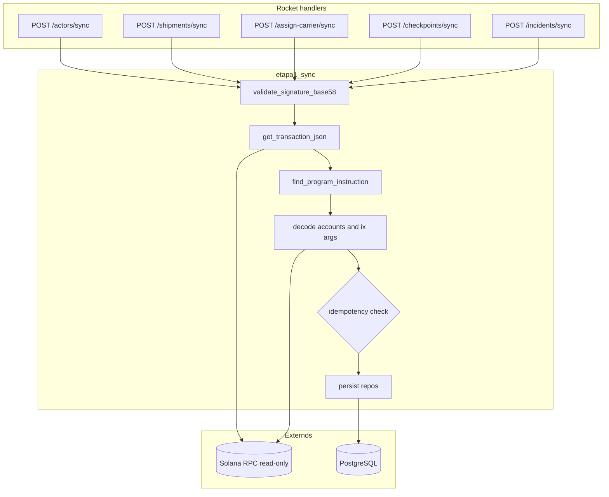
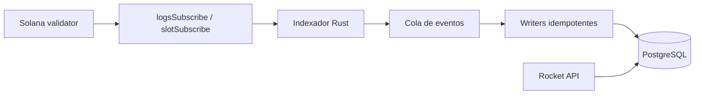
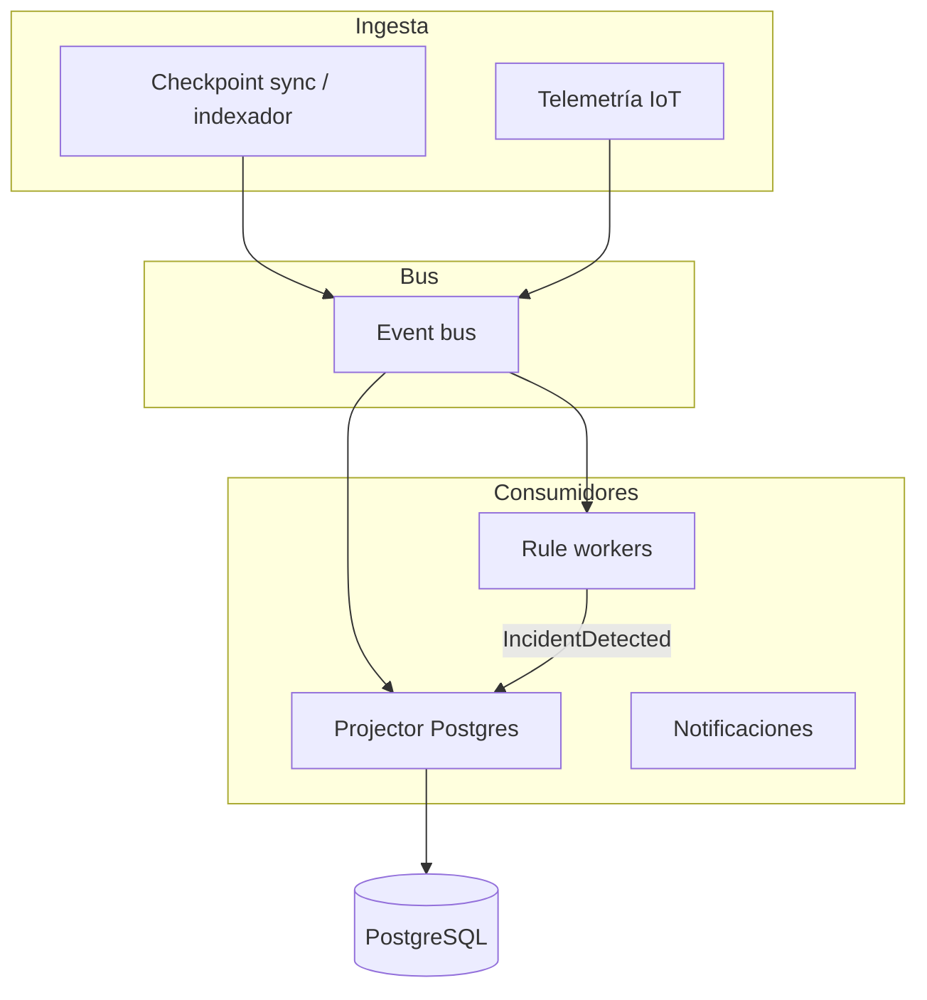
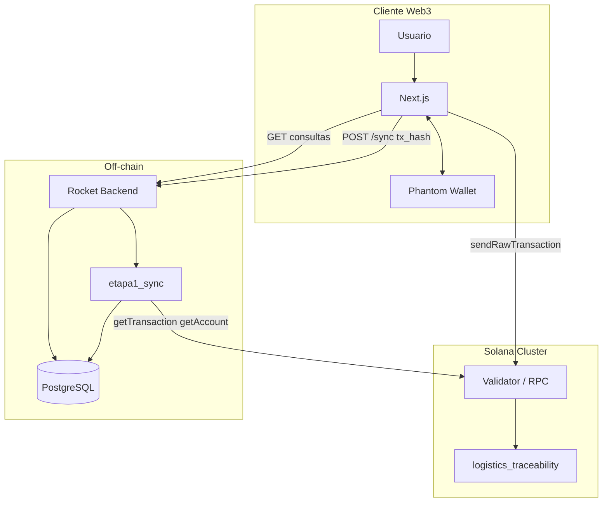
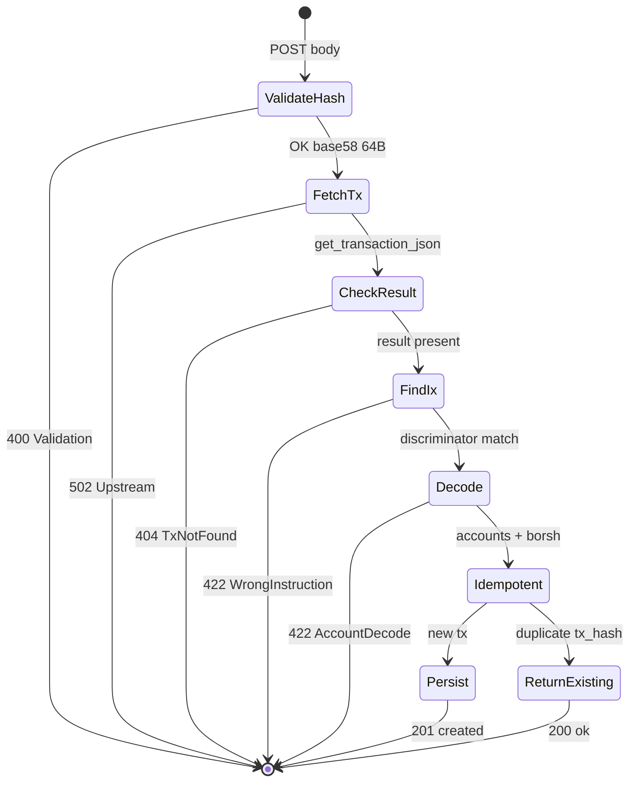
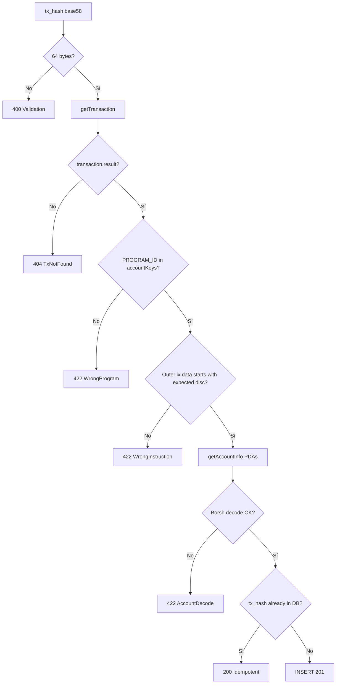

# Arquitectura blockchain y sincronización — TraceSol Logistics

**Proyecto:** Logistics Trace (TraceSol Logistics)  
**Versión del documento:** 1.0  
**Ámbito:** capa híbrida Solana ↔ PostgreSQL y motor de sync (`etapa1_sync`)  
**Documentos relacionados:** [01_SYSTEM_ARCHITECTURE.md](./01_SYSTEM_ARCHITECTURE.md) · [02_FUNCTIONAL_SPECIFICATION.md](./02_FUNCTIONAL_SPECIFICATION.md)

---

## Tabla de contenidos

1. [Filosofía Web3 del sistema](#1-filosofía-web3-del-sistema)
2. [Qué información vive on-chain y cuál off-chain](#2-qué-información-vive-on-chain-y-cuál-off-chain)
3. [Justificación técnica de arquitectura híbrida](#3-justificación-técnica-de-arquitectura-híbrida)
4. [Flujo de transacciones](#4-flujo-de-transacciones)
5. [Flujo de sincronización](#5-flujo-de-sincronización)
6. [Explicación técnica de tx_hash](#6-explicación-técnica-de-tx_hash)
7. [Estrategia de idempotencia](#7-estrategia-de-idempotencia)
8. [Validación de transacciones confirmadas](#8-validación-de-transacciones-confirmadas)
9. [Decodificación de instrucciones Anchor](#9-decodificación-de-instrucciones-anchor)
10. [Estrategia de consistencia eventual](#10-estrategia-de-consistencia-eventual)
11. [Manejo de errores y reintentos](#11-manejo-de-errores-y-reintentos)
12. [Estrategia futura de indexador automático](#12-estrategia-futura-de-indexador-automático)
13. [Arquitectura event-driven futura](#13-arquitectura-event-driven-futura)
14. [Seguridad y validaciones](#14-seguridad-y-validaciones)
15. [Tradeoffs arquitectónicos](#15-tradeoffs-arquitectónicos)
16. [Diagramas Mermaid](#16-diagramas-mermaid)
17. [Ventajas frente a arquitectura centralizada tradicional](#17-ventajas-frente-a-arquitectura-centralizada-tradicional)

---

## 1. Filosofía Web3 del sistema

TraceSol Logistics adopta un modelo **verify, don’t sign** en el servidor:

| Principio | Implementación |
|-----------|----------------|
| **Soberanía de claves** | Cada actor firma con Phantom; el backend nunca custodia keypairs operativos. |
| **Cadena como notario** | Estados contractuales, contadores y permisos viven en cuentas del programa Anchor. |
| **Proyección operativa** | PostgreSQL materializa lecturas rápidas, reglas y metadata extensa. |
| **Prueba por transacción** | Toda fila de escritura off-chain crítica se correlaciona con un `tx_hash` verificable en Solana. |
| **Transparencia verificable** | Cualquier auditor puede contrastar UUID de servicio ↔ firma ↔ cuenta on-chain. |

El usuario **no confía ciegamente en la API**: confía en que la API **reproduce** lo que ya quedó acordado en la red tras confirmación.

---

## 2. Qué información vive on-chain y cuál off-chain

### 2.1 On-chain (programa `logistics_traceability`)

| Entidad | Contenido principal | Motivo |
|---------|---------------------|--------|
| **ProgramConfig** | `authority`, contadores globales | Gobierno del despliegue |
| **Actor** | wallet, rol, nombre, ubicación, contadores | Identidad participante |
| **Shipment** | ids, wallets, producto, ruta, estado, frío, carrier, detalles compactos | Contrato logístico |
| **Checkpoint** | tipo, geo, temp/humedad, metadata acotada, shipment_id | Eventos firmados |
| **Incidencia crítica** | tipo, severidad on-chain, `evidence_hash[32]` | Hechos disputables |

Campos típicos en **Shipment** on-chain: `weight_grams`, `quantity`, `quantity_unit`, `estimated_delivery_at` (unix), `reference_code`, `priority`, `notes` (máx. 256 chars), `carrier` pubkey.

### 2.2 Off-chain (PostgreSQL + API)

| Entidad / dato | Contenido | Motivo |
|----------------|-----------|--------|
| **UUID de servicio** | `shipments.id` | URLs y consulta pública |
| **Detalles extendidos** | ETA ISO, notas largas vía sync body | Coste y flexibilidad |
| **Checkpoint metadata** | JSON enriquecido post-sync | IoT, etiquetas, contexto UI |
| **Incidencias automáticas** | Motor `incident_engine`, `evidence_json` | Reglas y telemetría |
| **Telemetría** | Series temporales, simuladores demo | Volumen y frecuencia |
| **Catálogos** | Productos, ubicaciones, umbrales, severidad | Configuración operativa |
| **Resolución incidencia** | Estado `Resolved` off-chain | Flujo operativo sin gas |

### 2.3 Matriz de fuente de verdad

| Dato | Fuente de verdad | Réplica off-chain |
|------|------------------|-------------------|
| Estado Shipment contractual | On-chain | Sí, actualizado en sync + transiciones checkpoint |
| Existencia Actor | On-chain | Sí |
| Secuencia checkpoints autorizados | On-chain (cuentas + orden por sync) | Sí |
| Incidencia crítica anclada | On-chain (`tx_hash`) | Sí |
| Alerta automática (auto) | Off-chain | Opcional anclaje posterior |
| Listados / mapas / hub | Off-chain | N/A (derivado) |

---

## 3. Justificación técnica de arquitectura híbrida

### Coste y rendimiento

- Leer miles de envíos desde RPC es lento y caro; **SQL indexado** sirve paneles y filtros por rol.
- Metadata de sensor y reglas de negocio cambian con frecuencia; almacenarlos enteramente on-chain multiplicaría **rent y complejidad**.

### Expresividad del contrato

- Anchor impone límites de tamaño en strings y cuentas; el MVP **compacta** en cadena y **expande** en sync.
- `merge_shipment_details` prioriza on-chain y completa huecos con el cuerpo HTTP.

### Seguridad operativa

- Sin claves en el backend se reduce superficie de robo y requisitos de cumplimiento (HSM, rotación, etc.).
- Un compromiso de Postgres **no permite falsificar** historial ya confirmado en Solana (solo desincronizar la proyección).

### Experiencia de usuario

- Phantom es el estándar del ecosistema Solana para firmar.
- La UI puede mostrar mapas y timelines ricos mientras la **prueba** permanece en la firma.

---

## 4. Flujo de transacciones



### Implementación frontend (`confirmSerializedTx`)

1. Obtiene `blockhash` y `lastValidBlockHeight` con commitment `confirmed`.
2. Construye `Transaction` con `feePayer` = wallet conectada.
3. Firma vía `signTransactionWithPhantom`.
4. `sendRawTransaction` + `confirmTransaction` con el mismo blockhash.
5. Devuelve la **signature** base58 → usada como `tx_hash` en sync.

### Instrucciones soportadas en sync

| Endpoint sync | Discriminador Anchor (`global:*`) |
|---------------|-----------------------------------|
| `POST /actors/sync` | `register_actor` |
| `POST /shipments/sync` | `create_shipment` |
| `POST /shipments/assign-carrier/sync` | `assign_carrier` |
| `POST /checkpoints/sync` | `record_checkpoint` |
| `POST /incidents/sync` | `report_critical_incident` |

El discriminador se calcula como los primeros 8 bytes de `SHA256("global:" + nombre_instrucción)`, alineado con Anchor y el frontend (`discriminators.rs` / `ix.ts`).

---

## 5. Flujo de sincronización

El pipeline vive en `backend/src/services/etapa1_sync/`. Los handlers HTTP (`handlers/sync/*`) son **delgados**: validan `PROGRAM_ID`, delegan y mapean errores.

### Fases comunes de cada `sync_*`

| Fase | Acción |
|------|--------|
| 1 | `validate_signature_base58(tx_hash)` |
| 2 | Resolver `commitment` (default `"confirmed"`) |
| 3 | `get_transaction_json(tx_hash)` vía RPC |
| 4 | Verificar `transaction_result` presente (tx confirmada) |
| 5 | `find_program_instruction(tx, PROGRAM_ID, discriminator_esperado)` |
| 6 | Leer cuentas PDAs / decodificar args de instrucción si aplica |
| 7 | `get_account_data` + decode Borsh (`decode_*_account`) |
| 8 | Comprobar idempotencia por `tx_hash` / claves naturales |
| 9 | Transacción SQL en `repos/*` |
| 10 | Retornar `SyncOutcome { created, body }` |

### Sync engine (vista lógica)



### Particularidades por dominio

| Sync | Lectura adicional | Post-persistencia |
|------|-------------------|-------------------|
| **Shipment** | `details` opcional en body; `merge_shipment_details` | `MonitoringService` hook |
| **Checkpoint** | Slot de tx; metadata en insert | `shipment_status_transition` |
| **Incident** | Decode args Borsh de instrucción; `anchor_incident_id` opcional | `update_status(Lost)` o `reconcile_lost_status` |
| **Assign carrier** | Verifica `carrier` ≠ default en cuenta Shipment | `update_carrier_wallet` |

---

## 6. Explicación técnica de tx_hash

En Solana, el **`tx_hash`** que usa TraceSol es la **signature de la transacción** en codificación **base58**.

| Propiedad | Detalle |
|-----------|---------|
| **Formato API** | String en JSON: `{ "tx_hash": "5xY..." }` |
| **Validación entrada** | `bs58::decode` → exactamente **64 bytes** (`validate_signature_base58`) |
| **Unicidad** | Una firma identifica de forma global una transacción en el cluster |
| **Uso en BD** | Columnas `creation_tx_hash`, `registration_tx_hash`, `tx_hash` en checkpoints/incidents |
| **Explorabilidad** | Enlazable a explorador del cluster (devnet/mainnet/localnet) |

No se aceptan hashes hex de 32 bytes ni placeholders: un sync con firma mal formada devuelve **400 Bad Request** antes de contactar RPC.

---

## 7. Estrategia de idempotencia

La idempotencia garantiza que **repetir el mismo sync con el mismo `tx_hash` no duplique** filas ni corrompa contadores.

### Mecanismos por entidad

| Entidad | Clave de idempotencia | Comportamiento si existe |
|---------|----------------------|---------------------------|
| **Actor** | `registration_tx_hash` = tx_hash | `created: false`, respuesta con wallet existente |
| **Actor** (alterno) | wallet ya en BD | `update_actor_from_chain_sync`, `created: false` |
| **Shipment** | `creation_tx_hash` = tx_hash | `created: false`, devuelve `shipment_id` existente |
| **Checkpoint** | `tx_hash` en tabla checkpoints | `created: false`; puede reconciliar `Delivered` |
| **Incident** | `tx_hash` en incidents | `created: false`, mismo `incident_id` |
| **Assign carrier** | Actualización por shipment (no segunda asignación on-chain) | Idempotente por estado on-chain |

### Respuesta HTTP

| `SyncOutcome.created` | Status Rocket |
|----------------------|---------------|
| `true` | `201 Created` (donde aplica) |
| `false` | `200 OK` |

El cliente puede reintentar sync tras timeout de red sin crear duplicados si la primera persistencia ya tuvo éxito.

### Límites de idempotencia

- Dos transacciones **distintas** que modifican el mismo envío producen **dos** checkpoints (correcto).
- La idempotencia es **por firma**, no por “último estado deseado” del cliente.
- Orden incorrecto de sync (checkpoint antes de shipment) falla con validación: *“sync shipment first”*.

---

## 8. Validación de transacciones confirmadas

### RPC: `getTransaction`

- Cliente: `HttpSolanaRpcClient::get_transaction_json(signature, commitment)`.
- Encoding: **JSON** (layout estándar Solana RPC).
- Si `transaction_result(tx)` es `None` → **`SolanaSyncError::TxNotFound`** → HTTP **404**.

### Commitment

| Valor | Uso |
|-------|-----|
| `confirmed` (default) | Balance entre latencia y seguridad; alineado con `confirmSerializedTx` en frontend |
| Override body | `commitment` opcional en `SyncRequestBody` |

### Validación de programa

1. Extraer `message.accountKeys` de la transacción.
2. `program_in_transaction` debe incluir `PROGRAM_ID` del backend (variable de entorno).
3. Si no → **`WrongProgram`** → HTTP **422**.

### Validación de instrucción

- Iterar instrucciones **outer** de la transacción.
- Filtrar por índice de programa = `PROGRAM_ID`.
- Comparar primeros 8 bytes de `data` con discriminador esperado del endpoint.
- Si ninguna coincide → **`WrongInstruction`** → HTTP **422**.

Esto evita que un `tx_hash` válido de **otra operación** (p. ej. `register_actor`) se sincronice por el endpoint de shipments.

---

## 9. Decodificación de instrucciones Anchor

### Cuentas (Borsh + discriminador de cuenta)

Las cuentas Anchor llevan prefijo de 8 bytes: `SHA256("account:" + TypeName)[..8]`.

```text
account_data = [discriminator 8B][borsh_payload][padding InitSpace]
```

Funciones en `solana/decode.rs`:

- `strip_account_discriminator("Shipment", data)`
- `decode_shipment_account` → `ShipmentAccountData`
- Análogo para `Actor`, `Checkpoint`

El decoder tolera **padding trailing** en cuentas `InitSpace` (comportamiento documentado en tests).

### Instrucciones con argumentos

Para `report_critical_incident`, los args van en el **data** de la instrucción:

- Bytes 0..8: discriminador `global:report_critical_incident`
- Bytes 8..: Borsh de `incident_type`, `severity`, `evidence_hash`, `description`

`decode_report_critical_incident_ix` en `decode_instructions.rs` valida discriminador y deserializa args.

### Resolución de cuentas de la instrucción

`resolve_ix_accounts` mapea índices de la instrucción a pubkeys de `accountKeys` (soporta formato legacy y versioned según JSON RPC).

### Alineación frontend ↔ backend

Tests fijan discriminadores críticos (ej. `report_critical_incident` = `[0x4b, 0x90, 0x61, 0x0e, 0xf4, 0x56, 0x8f, 0x97]`) para evitar drift entre `ix.ts` y `discriminators.rs`.

---

## 10. Estrategia de consistencia eventual

El sistema es **eventualmente consistente** entre Solana y PostgreSQL:

```text
T0: TX confirmada en Solana     → fuente de verdad inmediata
T1: Cliente llama POST /sync    → ventana de segundos
T2: RPC indexa getTransaction   → puede fallar brevemente (TxNotFound)
T3: Postgres actualizado        → UI lee API consistente
```

### Garantías actuales

| Garantía | Mecanismo |
|----------|-----------|
| **No persistir sin TX** | Sync exige `transaction_result` |
| **No persistir instrucción incorrecta** | Discriminador por endpoint |
| **Estado shipment alineado tras sync** | Lectura de cuenta Shipment post-TX |
| **Reconciliación lectura** | `reconcile_lost_status`, `reconcile_delivered_status` en GET/sync |

### Ventanas de inconsistencia aceptadas

- UI muestra “éxito on-chain” antes de que GET listados refleje el envío → se mitiga con **refresh** post-sync.
- RPC lag → **`postSyncWithRetry`** en frontend (hasta 6 intentos, backoff lineal).
- Motor de incidencias off-chain puede disparar **antes** de que el usuario ancle on-chain → diseño: incidencia `auto` + anclaje opcional.

### Orden recomendado de sync

```text
initialize (sin sync backend) → register_actor → create_shipment → assign_carrier → checkpoints → incidents
```

Violaciones de orden devuelven validación explícita, no escritura parcial incoherente.

---

## 11. Manejo de errores y reintentos

### Taxonomía backend (`SolanaSyncError`)

| Variante | HTTP | Causa típica |
|----------|------|--------------|
| `TxNotFound` | 404 | TX aún no indexada o firma inexistente |
| `WrongProgram` | 422 | `PROGRAM_ID` no en la transacción |
| `WrongInstruction` | 422 | Discriminador no coincide con endpoint |
| `MalformedTransaction` | 422 | JSON RPC inesperado / índices inválidos |
| `AccountDecode` | 422 | Cuenta corrupta o discriminador de cuenta erróneo |
| `Validation(_)` | 400 | Reglas de negocio (orden sync, pérdida registrada, overflow ids) |
| `Conflict(_)` | 409 | Colisión semántica (reservado) |
| `Upstream(_)` | 502 | Fallo RPC / red |

Mapeo centralizado: `handlers/sync/mod.rs::map_sync_error`.

### Reintentos frontend

`postSyncWithRetry` (`syncWithRetry.ts`):

| Parámetro | Default |
|-----------|---------|
| `maxAttempts` | 6 |
| `initialDelayMs` | 750 |
| Condición reintento | Solo si respuesta equivale a **Tx not found** (404 o mensaje) |

Tras firma, el cliente asume que la TX **existe** pero el nodo RPC del backend puede ir **retrasado** respecto al RPC del navegador.

### Errores no reintentables automáticamente

- `WrongInstruction`, `Validation`, `WrongProgram` → corregir operación o endpoint.
- Pérdida ya registrada → usuario debe cerrar flujo de incidencias.

### Configuración crítica

| Variable | Efecto si ausente |
|----------|-------------------|
| `PROGRAM_ID` | Todos los `POST /*/sync` → **503 Service Unavailable** |
| `SOLANA_RPC_URL` | Sync falla con **502** upstream |

---

## 12. Estrategia futura de indexador automático

Hoy el **cliente es el indexador**: tras cada TX, invoca sync. Limitaciones:

- Si el usuario cierra el navegador antes del sync, Postgres queda desactualizado hasta un **sync manual** o herramienta de recuperación.
- No hay suscripción a slots en el backend.

### Indexador propuesto (fase 2)



| Componente | Responsabilidad |
|------------|-----------------|
| **Subscriber** | Escuchar transacciones que invocan `PROGRAM_ID` |
| **Parser** | Reutilizar `find_program_instruction` + decode existente |
| **Writer** | Misma lógica que `etapa1_sync`, misma idempotencia por `tx_hash` |
| **API sync** | Mantener como **fallback** y para cuerpos `details` solo-HTTP |

Beneficios: recuperación ante fallos de cliente, consistencia más rápida, base para analytics en tiempo casi real.

---

## 13. Arquitectura event-driven futura

### Estado actual (pull + timers)

- Sync: **pull** por `tx_hash`.
- Motor incidencias: **polling** cada 20–45 s sobre envíos activos (`spawn_incident_engine`).

### Estado objetivo (push)



| Evento (ejemplo) | Productores | Consumidores |
|------------------|-------------|--------------|
| `ShipmentCreated` | Indexador | Projector, monitoring |
| `CheckpointRecorded` | Indexador | Status projector, reglas retraso |
| `TelemetryReceived` | IoT gateway | Cold chain, humidity, route |
| `CriticalIncidentAnchored` | Indexador | Auditoría, webhooks |

El módulo **`incident_engine`** evolucionaría de timers a **consumidores suscritos**, manteniendo reglas y severidad en Postgres.

---

## 14. Seguridad y validaciones

### Perímetro

| Control | Descripción |
|---------|-------------|
| **Sin firma servidor** | `SolanaRpcClient` solo expone lectura |
| **CORS** | Orígenes explícitos (`CORS_ALLOWED_ORIGINS`) |
| **PROGRAM_ID** | Rechazo de transacciones de otros programas |
| **Discriminador por ruta** | Un endpoint no acepta otra instrucción |

### Validaciones de negocio en sync

| Regla | Ejemplo |
|-------|---------|
| Shipment previo | Checkpoint/incident exigen shipment en BD |
| Pérdida | No nuevas incidencias si `loss_incident_exists` |
| Carrier en assign | TX debe haber escrito `carrier` distinto de default |
| Overflow ids | `u64` on-chain → `i64` / UUID con error claro |

### Confianza en datos off-chain del cliente

- El cuerpo `details` en shipment sync **no sustituye** campos ya fijados on-chain (`merge_shipment_details`).
- Un cliente malicioso no puede inventar un shipment sin TX: el decode de cuenta Shipment es obligatorio.

### Wallet en consultas autenticadas

- `GET /shipments?wallet=` — filtrado por rol en backend (`access`, repos).
- Consulta pública **sin** wallet; datos sensibles enmascarados.

---

## 15. Tradeoffs arquitectónicos

| Decisión | Ventaja | Coste |
|----------|---------|-------|
| Sync manual post-TX | Simple, sin infra de indexación | Dependencia del cliente; lag RPC |
| Postgres como lectura | Queries rápidos, JOINs, motor de reglas | Posible desfase temporal |
| Phantom-only signing | UX Web3 estándar | Usuarios deben tener wallet |
| Discriminadores fijos por endpoint | Seguridad contra TX equivocada | Nuevo tipo de ix → nuevo endpoint o rama |
| `confirmed` commitment | UX fluida | Menor finalidad que `finalized` en mainnet |
| Detalles híbridos | Flexibilidad operativa | Dos fuentes a reconciliar en disputas |
| Simuladores telemetría | Demo sin IoT real | No representativo de producción |

### Cuándo elegir `finalized` (futuro)

En mainnet con alto valor económico, exponer `commitment: "finalized"` en sync para reducir riesgo de reorganización de slot (a costa de latencia).

---

## 16. Diagramas Mermaid

### 16.1 Flujo blockchain (end-to-end)



### 16.2 Sync engine (detalle)



### 16.3 Validación de transacciones



---

## 17. Ventajas frente a arquitectura centralizada tradicional

| Dimensión | TMS / DB centralizado clásico | TraceSol híbrido Web3 |
|-----------|------------------------------|------------------------|
| **Prueba ante terceros** | Logs editables, confianza en operador | Transacción verificable en explorador |
| **Identidad de actor** | Usuario/contraseña | Wallet criptográfica |
| **No repudio** | Depende de políticas internas | Firma on-chain por operación |
| **Integración multi-organización** | APIs privadas, acuerdos de confianza | Programa público + wallets |
| **Disputas legales** | Export CSV, cadena de custodia interna | Hash + estado contractual inmutable |
| **Rendimiento UI** | Nativo en SQL | SQL + verdad en cadena |
| **Coste operativo** | Infra DB + app | + RPC Solana + gas (mínimo en L1 según red) |

TraceSol **no elimina** la base de datos central: la **subordina** a la cadena para hechos contractuales y la **potencia** para reglas, telemetría y UX. Es el patrón habitual de aplicaciones Web3 maduras: **on-chain truth, off-chain scale**.

---

## Referencias de implementación

| Módulo | Ruta |
|--------|------|
| Pipeline sync | `backend/src/services/etapa1_sync/` |
| Errores sync | `backend/src/solana/mod.rs` |
| Parseo TX | `backend/src/solana/parse.rs` |
| Discriminadores | `backend/src/solana/discriminators.rs` |
| Decode cuentas | `backend/src/solana/decode.rs` |
| Decode instrucción incidencia | `backend/src/solana/decode_instructions.rs` |
| Handlers HTTP | `backend/src/handlers/sync/` |
| Reintento cliente | `frontend/src/lib/api/syncWithRetry.ts` |
| Firma y confirmación | `frontend/src/lib/solana/confirmSerializedTx.ts` |
| RPC HTTP | `backend/src/solana/rpc_http.rs` |

---

## Conclusión

La arquitectura blockchain/sync de TraceSol Logistics se basa en un contrato Anchor pequeño pero semánticamente rico, un **motor de sincronización pull** robusto e **idempotente por `tx_hash`**, y una proyección PostgreSQL que habilita operación logística real. El backend **verifica sin firmar**; Phantom y Solana **autorizan**; la API **materializa y enriquece**.

La evolución natural — indexador por slot, bus de eventos e IoT real — reutiliza el mismo núcleo de parseo y decode, minimizando riesgo de migración y preservando el modelo de confianza Web3.

---

*Documento 03 de la serie de documentación en `docs/`.*
