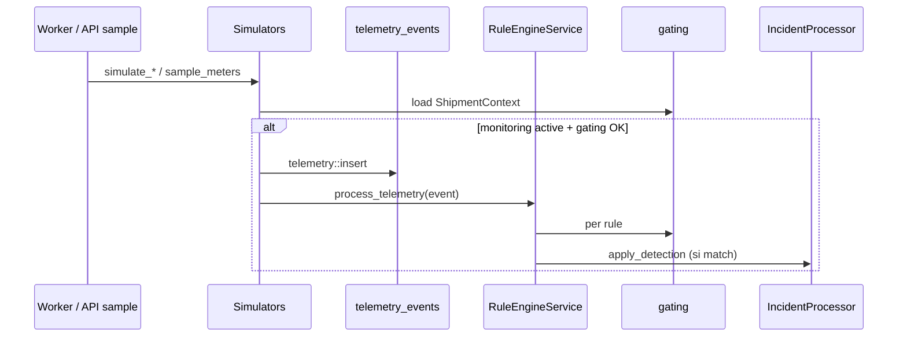
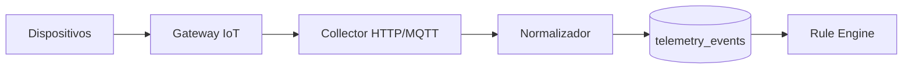
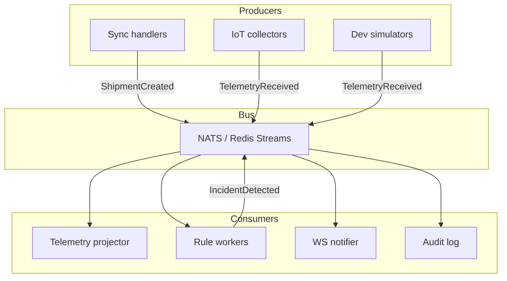
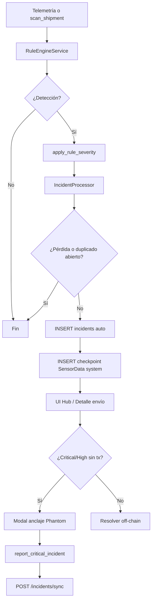
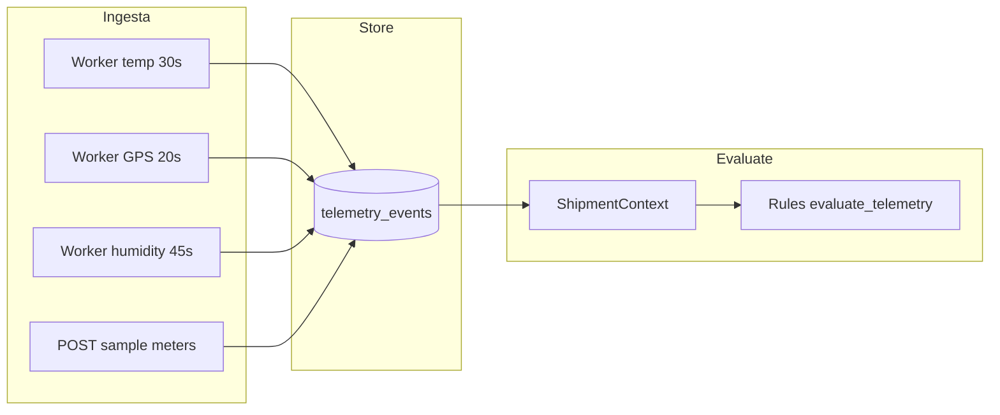

# Incident Intelligence Engine — TraceSol Logistics

**Proyecto:** Logistics Trace (TraceSol Logistics)  
**Versión del documento:** 1.0  
**Ámbito:** motor de incidencias automáticas off-chain (`incident_engine`) y evolución hacia plataforma inteligente  
**Documentos relacionados:** [01_SYSTEM_ARCHITECTURE.md](./01_SYSTEM_ARCHITECTURE.md) · [02_FUNCTIONAL_SPECIFICATION.md](./02_FUNCTIONAL_SPECIFICATION.md) · [03_BLOCKCHAIN_SYNC_ARCHITECTURE.md](./03_BLOCKCHAIN_SYNC_ARCHITECTURE.md)

---

## Tabla de contenidos

1. [Objetivo del módulo](#1-objetivo-del-módulo)
2. [Visión general](#2-visión-general)
3. [Arquitectura del Incident Engine](#3-arquitectura-del-incident-engine)
4. [Componentes](#4-componentes)
5. [Flujo de telemetría](#5-flujo-de-telemetría)
6. [Rule Engine](#6-rule-engine)
7. [Incidencias automáticas](#7-incidencias-automáticas)
8. [Modelo de datos incidents](#8-modelo-de-datos-incidents)
9. [Telemetry events](#9-telemetry-events)
10. [Generación automática de checkpoints](#10-generación-automática-de-checkpoints)
11. [Risk scoring](#11-risk-scoring)
12. [Integración futura IoT](#12-integración-futura-iot)
13. [Integración futura AI/ML](#13-integración-futura-aiml)
14. [WebSockets y alertas en tiempo real](#14-websockets-y-alertas-en-tiempo-real)
15. [Arquitectura event-driven futura](#15-arquitectura-event-driven-futura)
16. [Diagramas Mermaid](#16-diagramas-mermaid)
17. [Roadmap evolutivo](#17-roadmap-evolutivo)
18. [Consideraciones enterprise](#18-consideraciones-enterprise)

---

## 1. Objetivo del módulo

El **Incident Intelligence Engine** (IIE) detecta condiciones anómalas en envíos activos **sin sustituir la firma on-chain**: genera incidencias operativas en PostgreSQL, evidencia estructurada (`evidence_json`) y — cuando la severidad lo exige — habilita el **anclaje crítico** en Solana mediante el flujo existente de `report_critical_incident` + sync.

| Objetivo | Descripción |
|----------|-------------|
| **Detección temprana** | Temperatura, humedad, retraso, GPS y sensor offline |
| **Contexto logístico** | Reglas acotadas por fase del envío (post-pickup, en tránsito, sin pérdida) |
| **Configurabilidad** | Umbrales por producto (`cat_product`) y matriz de severidad (`incident_rules`) |
| **Trazabilidad operativa** | Checkpoint `SensorData` de sistema por cada detección |
| **Puente Web3** | Incidencias `auto` abiertas → modal de firma para Critical/High |

Activación: variable `INCIDENT_ENGINE_ENABLED` en el backend; si es `false`, `spawn_incident_engine` no arranca workers.

---

## 2. Visión general

```text
┌─────────────────────────────────────────────────────────────────┐
│                    Fuentes de datos (hoy)                        │
│  Simuladores periódicos  │  POST sample meters  │  (futuro IoT) │
└────────────────────────────┬────────────────────────────────────┘
                             ▼
                    ┌─────────────────┐
                    │ telemetry_events │
                    └────────┬────────┘
                             ▼
                    ┌─────────────────┐
                    │  Rule Engine    │◄── ShipmentContext + gating
                    └────────┬────────┘
                             ▼
                    ┌─────────────────┐
                    │ IncidentProcessor│
                    └────────┬────────┘
                             ▼
              ┌──────────────┴──────────────┐
              ▼                             ▼
       ┌─────────────┐              ┌──────────────────┐
       │  incidents  │              │ checkpoints      │
       │  source:auto│              │ SensorData system│
       └──────┬──────┘              └──────────────────┘
              ▼
       ┌─────────────┐
       │ UI / Hub    │──► Anclaje on-chain (opcional)
       └─────────────┘
```

Hoy el motor es **pull + polling** (tokio `interval`), no un bus de eventos. La telemetría **dispara reglas en línea** (`process_telemetry`); el escaneo periódico cubre reglas **solo de envío** (retraso, sensor offline).

---

## 3. Arquitectura del Incident Engine

### Ubicación en el monorepo

| Ruta | Responsabilidad |
|------|-----------------|
| `backend/src/incident_engine/` | Módulo completo |
| `backend/src/incident_engine/jobs/mod.rs` | Workers en background |
| `backend/src/incident_engine/services/` | Orquestación reglas y monitoreo |
| `backend/src/incident_engine/rules/` | Reglas MVP |
| `backend/src/incident_engine/processors/` | Persistencia post-detección |
| `backend/src/incident_engine/repositories/` | SQLx |
| `backend/src/incident_engine/simulators/` | Ingesta demo |
| `backend/src/incident_engine/gating.rs` | Fase logística |
| `backend/src/incident_engine/severity.rs` | Resolución de severidad |

Arranque en `main.rs`: `spawn_incident_engine(pool, cfg.incident_engine_enabled)`.

### Integración con Etapa 1

Tras `sync_shipment` exitoso, `MonitoringService::start` registra el envío en `shipment_monitoring` con estado `active`. Solo envíos **monitoreados activos** reciben simulación y evaluación.

---

## 4. Componentes

### Estado implementado vs planificado

| Componente | Estado actual | Descripción |
|------------|---------------|-------------|
| **Collectors** | Planificado | Ingesta desde gateways IoT / HTTP; hoy lo cubren **simulators** + API sample |
| **Simulators** | Implementado | GPS, temperatura, humedad en workers y `sample_meters_on_demand` |
| **Rules** | Implementado | 5 reglas + trait `IncidentRule` |
| **Processors** | Implementado | `IncidentProcessor::apply_detection` |
| **Alerts** | Parcial (UI + hub) | Sin canal push; listados y badges en panel |
| **WebSocket** | Planificado | Sin endpoint WS en backend actual |

### 4.1 Simulators (ingesta demo actual)

Funciones en `incident_engine/simulators/mod.rs`:

| Función | Intervalo worker | Acción |
|---------|------------------|--------|
| `simulate_temperature_for_shipment` | 30 s | Inserta telemetría + `process_telemetry` |
| `simulate_gps_for_shipment` | 20 s | Idem GPS |
| `simulate_humidity_for_shipment` | 45 s | Idem humedad |
| `sample_meters_on_demand` | API `POST .../telemetry/sample` | Muestra instantánea para demos |

Los simuladores generan lecturas **dentro de rango** por defecto; las incidencias aparecen cuando umbrales, ruta o tiempos violan reglas (o en pruebas con valores forzados).

### 4.2 Rules

Implementación del patrón **Strategy** vía trait `IncidentRule`:

```rust
async fn evaluate_telemetry(&self, telemetry, shipment) -> Option<IncidentDetectionResult>;
async fn evaluate_shipment(&self, shipment) -> Option<IncidentDetectionResult>;
```

Registro en `all_rules()`: ColdChain, Humidity, SensorOffline (vacío en shipment), RouteDeviation, Delay.

Evaluación offline de sensor: `evaluate_offline()` separado en `rules/offline.rs`.

### 4.3 Processors

`IncidentProcessor`:

1. Bloquea si hay pérdida registrada o incidencia abierta del **mismo tipo**.
2. `insert_auto` en `incidents`.
3. Incrementa `shipments.incident_count`.
4. Inserta checkpoint `SensorData` con `actor_wallet = system@incident-engine`, `tx_hash = system:{incident_id}`.

### 4.4 Collectors (diseño futuro)

```text
IoT Gateway → HTTP/MQTT adapter → Collector service → telemetry_events
                                      ↓
                              TelemetryReceived (evento)
```

Responsabilidades previstas: autenticación de dispositivo, normalización de unidades, deduplicación por `(device_id, recorded_at)`.

### 4.5 Alerts (capa presente y futura)

| Canal | Hoy | Futuro |
|-------|-----|--------|
| Hub `/panel/incidentes` | Tabla filtrable | + suscripciones |
| Detalle envío | Badge incidencias abiertas | Push |
| Modal auto-anclaje | Critical/High sin `tx_hash` | Workflow aprobación |

### 4.6 WebSocket (planificado)

Canal propuesto: `ws://api/v1/incidents/stream?wallet=` emitiendo `IncidentDetected`, `IncidentResolved`, `TelemetryAnomaly`. No implementado en Rocket en la versión documentada.

---

## 5. Flujo de telemetría



### Tipos de telemetría

| `telemetry_type` | Campos usados | Reglas |
|------------------|---------------|--------|
| `temperature` | `value_numeric` (°C) | `cold_chain_limit` |
| `humidity` | `value_numeric` (%) | `humidity_limit` |
| `gps` | `latitude`, `longitude` | `route_deviation` |

### Monitoreo activo

Tabla `shipment_monitoring`:

| Campo | Valor |
|-------|-------|
| `status` | `active` \| `stopped` |
| `started_at` | Alta al sync de creación de envío |
| `stopped_at` | Parada explícita (futuro cierre automático en terminal) |

`monitoring::list_active_shipment_ids` alimenta los tres workers de simulación y el scan de reglas.

---

## 6. Rule Engine

`RuleEngineService` centraliza evaluación:

| Método | Cuándo |
|--------|--------|
| `process_telemetry` | Tras cada inserción de telemetría |
| `scan_shipment` | Worker cada 300 s + evaluación shipment-only |

Flujo interno:

1. `load_shipment_context` (producto, umbrales, pickup, último checkpoint, pérdida).
2. Cargar `active_severities_by_rule` desde `incident_rules`.
3. Para cada regla: evaluar → `apply_rule_severity` → `IncidentProcessor::apply_detection`.

### Gating (fase logística)

Módulo `gating.rs` — funciones clave:

| Función | Efecto |
|---------|--------|
| `allows_incident_detection` | `false` si `has_registered_loss` |
| `logistics_started` | Requiere pickup o estado ≠ Created |
| `in_transit_monitoring` | No terminales (Delivered, Cancelled, Returned, Lost) |
| `allows_temperature_rules` | Tránsito + (frío o umbrales temp producto) |
| `allows_gps_rules` | InTransit, AtHub, OutForDelivery |
| `allows_delay_rule` | Tránsito + último checkpoint logístico conocido |
| `allows_sensor_offline` | Subconjunto de reglas de temperatura |
| `allows_humidity_rules` | Tránsito + límites humedad en producto |

### Matriz de severidad

Tabla `incident_rules` + `severity.rs`:

| `rule_name` | `incident_type` | Severidad MVP (BD) |
|-------------|-----------------|-------------------|
| `cold_chain_limit` | `COLD_CHAIN_BROKEN` | **Critical** |
| `humidity_limit` | `HUMIDITY_OUT_OF_RANGE` | High |
| `shipment_delay` | `SHIPMENT_DELAYED` | High |
| `route_deviation` | `ROUTE_DEVIATION` | High |
| `sensor_offline` | `SENSOR_OFFLINE` | Medium |

`resolve_for_rule` prioriza BD; si el valor no es válido (`Critical|High|Medium|Low`), usa default en código.

---

## 7. Incidencias automáticas

### 7.1 Cold chain broken (`COLD_CHAIN_BROKEN`)

| Atributo | Valor |
|----------|-------|
| Regla | `cold_chain_limit` |
| Trigger | Telemetría `temperature` fuera de `cat_product` o frío requerido |
| Gating | `allows_temperature_rules` |
| Evidencia | temp, min/max, producto, estado |

### 7.2 Shipment delayed (`SHIPMENT_DELAYED`)

| Atributo | Valor |
|----------|-------|
| Regla | `shipment_delay` |
| Trigger | `evaluate_shipment` — sin checkpoint logístico ≥ **2 h** |
| Gating | `allows_delay_rule` |
| Evidencia | `last_logistics_checkpoint_at`, horas transcurridas |

> El umbral está en código (`HOURS_WITHOUT_CHECKPOINT = 2`); `condition_json` en BD documenta el contrato para futura externalización.

### 7.3 Route deviation (`ROUTE_DEVIATION`)

| Atributo | Valor |
|----------|-------|
| Regla | `route_deviation` |
| Trigger | GPS a > **5 km** del punto medio origen–destino (haversine) |
| Gating | `allows_gps_rules` + coordenadas parseables en origen/destino |
| Evidencia | lat/lng, `deviation_km` |

### 7.4 Sensor offline (`SENSOR_OFFLINE`)

| Atributo | Valor |
|----------|-------|
| Regla | `sensor_offline` |
| Trigger | `evaluate_offline` — sin telemetría `temperature` ≥ **10 min** |
| Gating | `allows_sensor_offline` (producto con control térmico) |
| Evidencia | `last_telemetry_at`, minutos |

### 7.5 Humidity out of range (`HUMIDITY_OUT_OF_RANGE`)

Complemento al catálogo frío; misma familia de detección por telemetría con umbrales `%` del producto.

### Dedupe y ciclo de vida auto

| Regla | Comportamiento |
|-------|----------------|
| Mismo `incident_type` abierto | No inserta duplicado (`open_exists`) |
| Pérdida registrada | Motor silenciado |
| Resolución | `PATCH` / handler resolve — off-chain |
| Anclaje | `anchor_incident_id` en `POST /incidents/sync` vincula auto → on-chain |

### Puente on-chain (frontend)

`canAnchorAutoIncident`: `source === auto`, `Open`, sin `txHash`, severidad Critical o High.

Mapeo motor → programa: p. ej. `COLD_CHAIN_BROKEN` → `TempViolation`, `SHIPMENT_DELAYED` → `Delay`.

---

## 8. Modelo de datos incidents

### Tabla `incidents`

| Columna | Tipo | Descripción |
|---------|------|-------------|
| `id` | UUID PK | Identificador servicio |
| `shipment_id` | UUID FK | Envío |
| `incident_type` | TEXT | Código catálogo (`COLD_CHAIN_BROKEN`, …) |
| `severity` | TEXT | Critical, High, Medium, Low |
| `status` | TEXT | `Open`, `Resolved`, … |
| `source` | TEXT | `auto` \| `on_chain` \| `manual_offchain` |
| `description` | TEXT | Mensaje humano |
| `detected_at` | TIMESTAMPTZ | Alta |
| `resolved_at` | TIMESTAMPTZ | Cierre operativo |
| `evidence_json` | JSONB | Payload estructurado regla |
| `evidence_hash` | TEXT | Hash on-chain (si aplica) |
| `rule_name` | TEXT | Regla que disparó (auto) |
| `created_by_wallet` | TEXT | Manual / reporter |
| `tx_hash` | TEXT UNIQUE | Firma Solana si anclado |

Índices: por `shipment_id`, parcial `Open` en `status`.

### Tabla `incident_rules`

Configuración declarativa MVP:

| Campo | Uso |
|-------|-----|
| `rule_name` | PK lógica |
| `incident_type` | Tipo generado |
| `severity` | Prioridad UI y anclaje |
| `condition_json` | Documentación umbrales (evolución: motor lee JSON) |
| `is_active` | Apagado de regla |

### Relación con on-chain

Las incidencias **automáticas no son verdad contractual** hasta el anclaje. La verdad operativa inmediata está en Postgres; la **prueba externa** requiere `tx_hash` en `report_critical_incident`.

---

## 9. Telemetry events

### Tabla `telemetry_events`

| Columna | Descripción |
|---------|-------------|
| `shipment_id` | Envío monitoreado |
| `telemetry_type` | `temperature`, `humidity`, `gps` |
| `value_numeric` | Magnitud escalar |
| `latitude` / `longitude` | GPS |
| `metadata_json` | Extensión futura (device_id, battery, …) |
| `recorded_at` | Marca temporal |

Índice: `(shipment_id, recorded_at DESC)` para ventanas y offline.

### API de lectura

| Endpoint | Descripción |
|----------|-------------|
| `GET /api/v1/shipments/:id/telemetry?wallet=` | Últimas 100 lecturas (autorizado por rol) |
| `POST /api/v1/shipments/:id/telemetry/sample?wallet=` | Demo: dispara simuladores on-demand |

### Modelo en memoria

`TelemetryEvent` en `models.rs` — espejo de fila insertada, pasado al Rule Engine sin round-trip extra cuando viene del simulador.

---

## 10. Generación automática de checkpoints

Cada detección nueva crea un checkpoint **off-chain** de trazabilidad:

| Campo | Valor |
|-------|-------|
| `checkpoint_type` | `SensorData` |
| `actor_wallet` | `system@incident-engine` |
| `location` | `auto:{incident_type}` |
| `metadata_json` | `incident_id`, severidad, `source: incident_engine` |
| `tx_hash` | `system:{incident_uuid}` (UNIQUE, idempotente) |
| `on_chain_checkpoint_id` | Negativo secuencial (no confundir con cadena) |

También incrementa `shipments.checkpoint_count` para coherencia de métricas UI.

**Importante:** estos checkpoints **no** se firman en Solana; alimentan timeline operativo y excluyen lógica de “último checkpoint logístico” (filtros excluyen `system@` y `system:%` en `load_shipment_context`).

---

## 11. Risk scoring

### Implementación actual: severidad como proxy de riesgo

No existe un score numérico 0–100 en el MVP. La **priorización** se modela con:

| Nivel | Uso |
|-------|-----|
| **Critical** | Trazabilidad UI, modal anclaje, máxima urgencia |
| **High** | Anclaje elegible, hub destacado |
| **Medium** | Operación estándar |
| **Low** | Sensor offline, seguimiento |

### Fórmula de scoring futura (propuesta)

```text
risk_score = w1 * severity_weight
           + w2 * time_in_violation_minutes
           + w3 * product_criticality
           + w4 * deviation_magnitude_norm
```

Salida: bandas `low | medium | high | critical` alineadas con SLA del cliente.

### Tabla futura (opcional)

`incident_risk_scores(incident_id, score, factors_json, computed_at)` para historial y ML.

---

## 12. Integración futura IoT



| Capa | Responsabilidad |
|------|-----------------|
| **Dispositivo** | GPS, temp, humedad, puerta, vibración |
| **Gateway** | Agregación, buffer offline, TLS |
| **Collector** | Sustituye simulators en producción |
| **Catálogo** | `device_id` ↔ `shipment_id` en `metadata_json` |
| **Calidad** | Detección de lecturas stale, duplicadas, fuera de rango físico |

Contrato API propuesto: `POST /api/v1/telemetry/ingest` con API key por transportista (HMAC), batch de eventos.

Los **simulators** permanecerían en `dev` / `staging` para demos sin hardware.

---

## 13. Integración futura AI/ML

| Caso | Enfoque |
|------|---------|
| **Anomalía multivariante** | Modelo sobre ventanas de telemetría (LSTM / isolation forest) |
| **Predicción de retraso** | Features: distancia restante, histórico ruta, clima |
| **Clasificación de severidad** | Ajuste dinámico según producto y valor declarado |
| **Narrativa** | LLM resume `evidence_json` para operador (no sustituye reglas duras) |

Principio: las reglas **hard** (frío, pérdida, offline) permanecen; ML propone **alertas advisory** con `source: ml` hasta validación humana.

Pipeline batch: export `telemetry_events` → feature store → entrenamiento offline → despliegue de scores como regla más `MlAnomalyRule`.

---

## 14. WebSockets y alertas en tiempo real

### Estado actual

- Actualización por **polling HTTP** en hub y detalle de envío.
- Workers backend cada 20–45 s en telemetría simulada.

### Diseño objetivo

| Evento WS | Payload |
|-----------|---------|
| `incident.detected` | `incident_id`, `shipment_id`, `severity`, `type` |
| `incident.resolved` | `incident_id`, `resolved_at` |
| `telemetry.sample` | última lectura (opcional, baja prioridad) |

```text
Cliente panel ──subscribe──► WS hub ◄──publish── IncidentProcessor
```

Alternativa enterprise: **SSE** (`GET /incidents/stream`) para compatibilidad con proxies corporativos.

Alertas externas: webhook POST a SIEM / Slack / PagerDuty con plantilla por `incident_type` y severidad ≥ High.

---

## 15. Arquitectura event-driven futura

### Hoy (acoplamiento temporal)

```text
tokio::spawn → interval → simulate / scan_shipment → SQL
```

### Mañana (bus de dominio)



| Evento | Productor | Consumidor |
|--------|-----------|------------|
| `ShipmentMonitoringStarted` | sync shipment | Simulators schedule |
| `TelemetryReceived` | collector | RuleEngine `process_telemetry` |
| `IncidentDetected` | IncidentProcessor | WS, webhooks, métricas |
| `IncidentAnchored` | sync incident | Cerrar auto, auditoría |

Beneficios: desacoplar latencia RPC del cliente, reintentos por cola, escalado horizontal de evaluadores de reglas.

---

## 16. Diagramas Mermaid

### 16.1 Flujo de incidencias (detección → operación → cadena)



### 16.2 Flujo de telemetría



### 16.3 Flujo de detección automática (scan + telemetry)

```mermaid
sequenceDiagram
    participant T as Telemetry insert
    participant RE as RuleEngineService
    participant R1 as ColdChainRule
    participant R2 as DelayRule
    participant OFF as evaluate_offline
    participant IP as IncidentProcessor
    participant DB as PostgreSQL

    T->>RE: process_telemetry
    RE->>R1: evaluate_telemetry
    alt temp out of range
        R1-->>RE: IncidentDetectionResult
        RE->>IP: apply_detection
        IP->>DB: incidents + checkpoint
    end

    Note over RE,OFF: scan_shipment cada 300s
    RE->>R2: evaluate_shipment
    alt sin checkpoint 2h
        R2-->>RE: SHIPMENT_DELAYED
        RE->>IP: apply_detection
    end
    RE->>OFF: sensor offline
    alt sin temp 10 min
        OFF-->>RE: SENSOR_OFFLINE
        RE->>IP: apply_detection
    end
```

---

## 17. Roadmap evolutivo

| Fase | Entregable | Dependencias |
|------|------------|--------------|
| **MVP (actual)** | Reglas + simulators + severidad BD + anclaje UI | Postgres, `INCIDENT_ENGINE_ENABLED` |
| **Fase 2** | Collectors HTTP + device registry | Auth API, metadata |
| **Fase 3** | Event bus + indexador sync | Infra mensajería |
| **Fase 4** | WebSocket / webhooks | Fase 3 |
| **Fase 5** | Risk score + ML advisory | Datos históricos |
| **Fase 6** | Reglas declarativas 100% JSON en `condition_json` | Motor interpreta umbrales sin redeploy |

---

## 18. Consideraciones enterprise

| Tema | Recomendación |
|------|----------------|
| **Multi-tenant** | `tenant_id` en shipments y reglas; aislamiento de workers |
| **Cumplimiento** | Retención `telemetry_events` (30–90 días); PII en GPS |
| **Auditoría** | Log inmutable de `IncidentDetected` + quién resolvió / ancló |
| **SLA** | Métricas: tiempo detección → resolución, % ancladas Critical |
| **Alta disponibilidad** | Workers idempotentes; escalar lectura Postgres; bus redundante |
| **Seguridad ingest** | mTLS o HMAC en collectors; rate limit por shipment |
| **DR** | Replay de telemetría desde cold storage para recalcular incidencias |
| **Separación entornos** | Simulators solo en dev/staging; prod exige IoT o ingest firmado |

### Límites conocidos del MVP

- Umbrales de retraso y offline **hardcoded** en Rust (parcialmente documentados en `condition_json`).
- Checkpoints de sistema **no** on-chain.
- Sin WS: latencia de percepción = intervalo worker + refresh UI.
- Route deviation simplificada (corredor punto medio, no polilínea real).

---

## Referencias de implementación

| Artefacto | Ruta |
|-----------|------|
| Workers | `backend/src/incident_engine/jobs/mod.rs` |
| Rule engine | `backend/src/incident_engine/services/rule_engine_service.rs` |
| Processor | `backend/src/incident_engine/processors/incident_processor.rs` |
| Gating | `backend/src/incident_engine/gating.rs` |
| Migraciones | `backend/migrations/20260322120000_incidents_telemetry.sql`, `20260322120001_shipment_monitoring.sql`, `20260322120003_incident_engine_seeds.sql`, `20260518130000_incident_severity_matrix.sql` |
| UI anclaje | `frontend/src/lib/incidents/anchorOnChain.ts`, `criticalIncidentFlow.ts` |
| Hub | `frontend/src/app/panel/incidentes/`, `IncidentHubWorkspace.tsx` |

---

## Conclusión

El **Incident Intelligence Engine** de TraceSol Logistics es un motor **off-chain, basado en reglas y telemetría**, diseñado para complementar — no reemplazar — el contrato Solana. Hoy demuestra detección de cadena de frío, retrasos, desvíos y sensores inactivos mediante simuladores y workers; mañana evoluciona hacia **collectors IoT**, **eventos de dominio**, **alertas en tiempo real** y **scoring** sin romper el puente de anclaje crítico que da valor Web3 al negocio.

---

*Documento 04 de la serie de documentación en `docs/`.*
