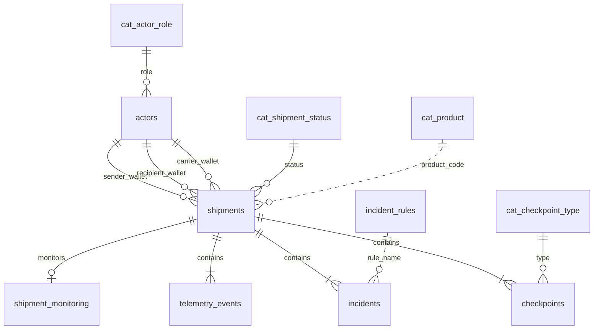
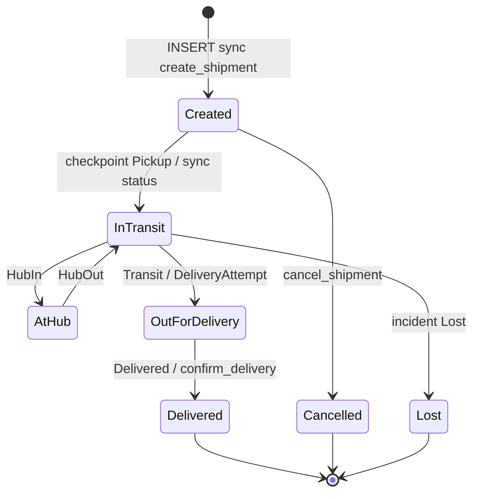
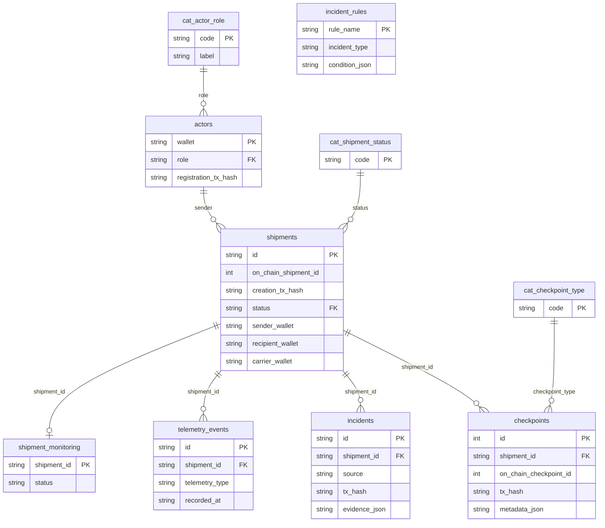
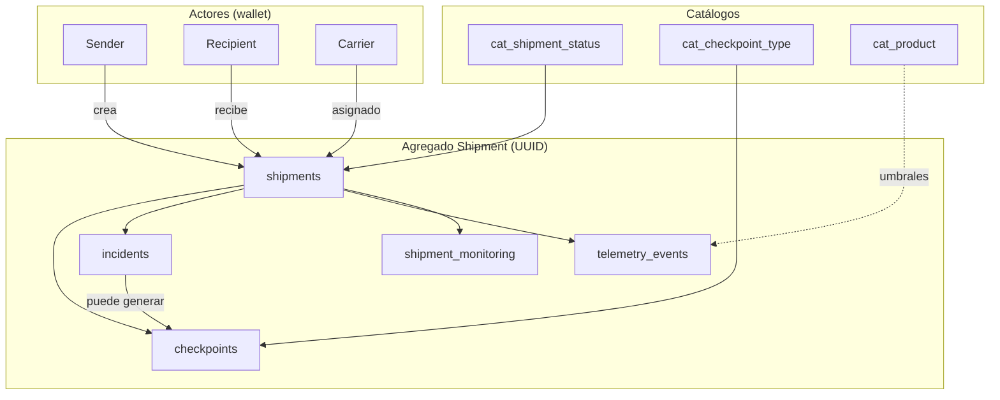
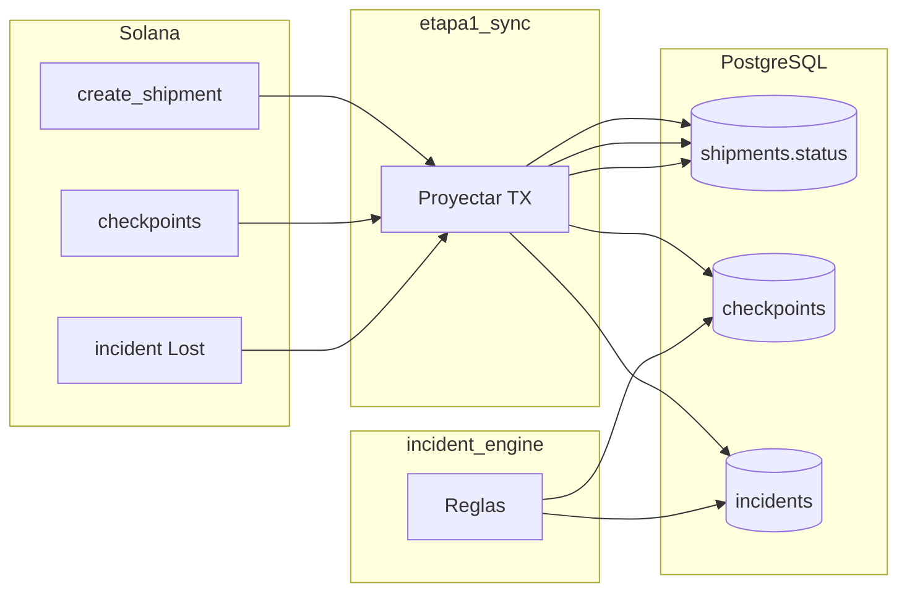

# Modelo de dominio y base de datos — TraceSol Logistics

**Proyecto:** Logistics Trace (TraceSol Logistics)  
**Versión del documento:** 1.0  
**Ámbito:** esquema PostgreSQL off-chain, entidades de dominio y estrategias de persistencia  
**Documentos relacionados:** [01_SYSTEM_ARCHITECTURE.md](./01_SYSTEM_ARCHITECTURE.md) · [03_BLOCKCHAIN_SYNC_ARCHITECTURE.md](./03_BLOCKCHAIN_SYNC_ARCHITECTURE.md) · [04_INCIDENT_INTELLIGENCE_ENGINE.md](./04_INCIDENT_INTELLIGENCE_ENGINE.md)

---

## Tabla de contenidos

1. [Objetivo del modelo de dominio](#1-objetivo-del-modelo-de-dominio)
2. [Principales entidades del sistema](#2-principales-entidades-del-sistema)
3. [Explicación funcional por entidad](#3-explicación-funcional-por-entidad)
4. [Relaciones entre entidades](#4-relaciones-entre-entidades)
5. [Ciclo de vida de un shipment](#5-ciclo-de-vida-de-un-shipment)
6. [Estrategia de estados](#6-estrategia-de-estados)
7. [Estrategia de idempotencia mediante tx_hash](#7-estrategia-de-idempotencia-mediante-tx_hash)
8. [Uso de JSONB](#8-uso-de-jsonb)
9. [Estrategia de catálogos](#9-estrategia-de-catálogos)
10. [Índices y optimización](#10-índices-y-optimización)
11. [Escalabilidad futura](#11-escalabilidad-futura)
12. [Event sourcing futuro](#12-event-sourcing-futuro)
13. [Diagramas Mermaid](#13-diagramas-mermaid)
14. [Estrategia de auditoría](#14-estrategia-de-auditoría)
15. [Consideraciones enterprise](#15-consideraciones-enterprise)

---

## 1. Objetivo del modelo de dominio

El modelo de datos PostgreSQL de TraceSol Logistics cumple tres funciones:

| Función | Descripción |
|---------|-------------|
| **Proyección on-chain** | Materializar actores, envíos y checkpoints confirmados en Solana con correlación por `tx_hash`. |
| **Operación logística** | Soportar listados por rol, detalle público (UUID), telemetría e incidencias automáticas. |
| **Integridad referencial** | Catálogos tipados (`cat_*`), FKs y unicidad que evitan duplicados de sincronización. |

PostgreSQL **no es** la fuente de verdad contractual (Solana lo es para hechos firmados), pero es la **fuente de verdad operativa** para la aplicación: consultas, motor de incidencias, mapas y hubs.

### Identificadores duales

| Capa | Identificador | Uso |
|------|---------------|-----|
| **Servicio / API / URLs** | `UUID` (`shipments.id`, `incidents.id`) | Consulta pública, panel, FKs internas |
| **On-chain** | `BIGINT` (`on_chain_shipment_id`, `on_chain_checkpoint_id`) | Alineación con cuenta Anchor |
| **Actores** | `TEXT` wallet (base58) | PK natural; coincide con pubkey Solana |

---

## 2. Principales entidades del sistema

```text
┌─────────────┐     ┌─────────────┐     ┌──────────────────┐
│  cat_*      │     │   actors    │     │    shipments     │
│  catálogos  │────►│  (wallet)   │────►│  (UUID + BIGINT) │
└─────────────┘     └─────────────┘     └────────┬─────────┘
                                                   │
                    ┌──────────────────────────────┼──────────────────────────────┐
                    ▼                              ▼                              ▼
            ┌───────────────┐              ┌───────────────┐              ┌──────────────────┐
            │  checkpoints  │              │   incidents   │              │ telemetry_events │
            │  (BIGSERIAL)  │              │    (UUID)     │              │     (UUID)       │
            └───────────────┘              └───────────────┘              └──────────────────┘
                    │                              │
                    └──────────────┬───────────────┘
                                   ▼
                          ┌─────────────────┐
                          │ incident_rules  │
                          │ shipment_monitoring │
                          └─────────────────┘
```

### Inventario de tablas

| Tabla | Tipo | Rol |
|-------|------|-----|
| `cat_actor_role` | Catálogo | Roles de actor |
| `cat_shipment_status` | Catálogo | Estados de envío |
| `cat_checkpoint_type` | Catálogo | Tipos de checkpoint |
| `cat_incident_type` | Catálogo | Tipos de incidencia |
| `cat_product` | Catálogo | Productos + umbrales IoT |
| `cat_location` | Catálogo | Orígenes/destinos logísticos |
| `actors` | Dominio | Participantes registrados |
| `shipments` | Dominio | Agregado raíz de trazabilidad |
| `checkpoints` | Dominio | Eventos logísticos (on-chain + sistema) |
| `incidents` | Dominio | Incidencias auto / on-chain / manual |
| `telemetry_events` | Dominio | Lecturas de sensores |
| `incident_rules` | Configuración | Motor de reglas |
| `shipment_monitoring` | Configuración | Envíos con monitoreo activo |

Migraciones versionadas en `backend/migrations/`; aplicación automática al arrancar Rocket (`sqlx migrate`).

---

## 3. Explicación funcional por entidad

### 3.1 Actors (`actors`)

Proyección de la cuenta on-chain **Actor** tras `register_actor` + sync.

| Columna | Tipo | Descripción |
|---------|------|-------------|
| `wallet` | TEXT **PK** | Pubkey base58 del actor |
| `role` | TEXT FK → `cat_actor_role` | Sender, Carrier, Hub, Recipient, Inspector |
| `name` | TEXT | Nombre operativo |
| `is_active` | BOOLEAN | Alta lógica |
| `location` | TEXT | Ubicación declarada |
| `shipments_created` | INTEGER | Contador (sync desde cadena) |
| `checkpoints_recorded` | INTEGER | Contador (sync) |
| `created_at` | TIMESTAMPTZ | Alta en BD |
| `registration_tx_hash` | TEXT **UNIQUE** | Firma de registro (idempotencia) |

**Reglas funcionales:**

- Un wallet es **único** en el sistema operativo.
- El rol se valida contra catálogo; cambios on-chain se reflejan en re-sync.
- `GET /actors/me?wallet=` resuelve rol para filtrado de envíos.

### 3.2 Shipments (`shipments`)

Agregado central; una fila por envío creado on-chain.

| Columna | Tipo | Descripción |
|---------|------|-------------|
| `id` | UUID **PK** | Identificador de servicio (`gen_random_uuid`) |
| `on_chain_shipment_id` | BIGINT **UNIQUE** | Id numérico en programa Solana |
| `sender_wallet` | TEXT | Remitente |
| `recipient_wallet` | TEXT | Destinatario |
| `carrier_wallet` | TEXT NULL | Transportista asignado (post `assign_carrier`) |
| `product` | VARCHAR(64) | Código producto (alineado `cat_product`) |
| `origin` / `destination` | VARCHAR(128) | Coordenadas o texto (a menudo `lat,lng`) |
| `status` | TEXT FK → `cat_shipment_status` | Estado operativo |
| `requires_cold_chain` | BOOLEAN | Frío requerido |
| `checkpoint_count` | INTEGER | Denormalizado (checkpoints + motor) |
| `incident_count` | INTEGER | Denormalizado |
| `created_at` | TIMESTAMPTZ | Creación |
| `delivered_at` | TIMESTAMPTZ NULL | Cierre entrega |
| `last_checkpoint_at` | TIMESTAMPTZ NULL | Último evento (monitoreo) |
| `creation_tx_hash` | TEXT **UNIQUE** | Firma `create_shipment` |
| `weight_kg`, `quantity`, `quantity_unit` | Detalle off-chain | Sync body + merge |
| `estimated_delivery_at` | TIMESTAMPTZ | ETA operativa |
| `reference_code` | VARCHAR(64) | Referencia externa |
| `priority` | VARCHAR(16) | `normal` \| `urgent` \| `express` (CHECK) |
| `notes` | TEXT | Notas extendidas |

**Reglas funcionales:**

- Creación idempotente por `creation_tx_hash`.
- Listados filtrados: participante, carrier asignado, o inventario completo (Hub/Inspector).
- Estado actualizado por sync de cuenta Shipment, transición tras checkpoint, incidencia Lost, o reconciliación en lectura.

### 3.3 Checkpoints (`checkpoints`)

Eventos logísticos; la mayoría provienen de `record_checkpoint` on-chain.

| Columna | Tipo | Descripción |
|---------|------|-------------|
| `id` | BIGSERIAL **PK** | Surrogate key interno |
| `shipment_id` | UUID FK → `shipments` | Envío padre |
| `on_chain_checkpoint_id` | BIGINT | Id on-chain (negativo para sistema) |
| `actor_wallet` | TEXT | Firmante o `system@incident-engine` |
| `checkpoint_type` | TEXT FK → `cat_checkpoint_type` | Pickup, Transit, SensorData, … |
| `location` | VARCHAR(256) | Texto ubicación |
| `latitude` / `longitude` | DOUBLE PRECISION | Geo opcional |
| `temperature_centi` | SMALLINT | Temperatura × 100 (centi) |
| `humidity` | SMALLINT | 0–100 % |
| `metadata_json` | JSONB | Payload extendido |
| `occurred_at` | TIMESTAMPTZ | Momento del evento |
| `tx_hash` | TEXT **UNIQUE** | Firma Solana o `system:{uuid}` |
| `slot` | BIGINT NULL | Slot de la transacción |
| `created_at` | TIMESTAMPTZ | Inserción en BD |

**Restricciones:**

- `UNIQUE (shipment_id, on_chain_checkpoint_id)` — un id on-chain por envío.
- `tx_hash` globalmente único — idempotencia de sync y checkpoints de motor.

**Reglas funcionales:**

- Timeline ordenada por `occurred_at`.
- Checkpoints `SensorData` con `system:%` no cuentan como “último checkpoint logístico” para reglas de retraso.
- `ON DELETE RESTRICT` en `shipment_id` — no borrar envíos con historial.

### 3.4 Incidents (`incidents`)

Incidencias operativas y anclaje on-chain.

| Columna | Tipo | Descripción |
|---------|------|-------------|
| `id` | UUID **PK** | Identificador servicio |
| `shipment_id` | UUID FK → `shipments` **ON DELETE CASCADE** | Padre |
| `incident_type` | TEXT | Código (`COLD_CHAIN_BROKEN`, `Lost`, …) |
| `severity` | TEXT | Critical, High, Medium, Low |
| `status` | TEXT | `Open`, `Resolved`, … |
| `source` | TEXT CHECK | `auto` \| `on_chain` \| `manual_offchain` |
| `description` | TEXT | Mensaje |
| `detected_at` | TIMESTAMPTZ | Detección |
| `resolved_at` | TIMESTAMPTZ NULL | Cierre operativo |
| `evidence_json` | JSONB | Evidencia estructurada |
| `evidence_hash` | TEXT | Hash 32 bytes on-chain (hex) |
| `rule_name` | TEXT NULL | Regla motor (`cold_chain_limit`, …) |
| `created_by_wallet` | TEXT NULL | Reporter manual |
| `tx_hash` | TEXT **UNIQUE** NULL | Firma si anclado |
| `created_at` | TIMESTAMPTZ | Alta |

**Reglas funcionales:**

- Una incidencia `auto` abierta por tipo no se duplica (`open_exists`).
- `anchor_incident_id` en sync vincula auto existente con TX on-chain.
- Pérdida (`Lost` / `SHIPMENT_LOST`) bloquea nuevas incidencias y motor.

### 3.5 Telemetry events (`telemetry_events`)

Lecturas off-chain para el motor (hoy: simuladores + sample API).

| Columna | Tipo | Descripción |
|---------|------|-------------|
| `id` | UUID **PK** | Evento |
| `shipment_id` | UUID FK **CASCADE** | Envío monitoreado |
| `telemetry_type` | TEXT | `temperature`, `humidity`, `gps` |
| `value_numeric` | DOUBLE PRECISION | Magnitud |
| `latitude` / `longitude` | DOUBLE PRECISION | GPS |
| `metadata_json` | JSONB | device_id, calidad, … (futuro) |
| `recorded_at` | TIMESTAMPTZ | Timestamp lectura |

**Reglas funcionales:**

- Append-only en operación normal.
- Alimenta `RuleEngineService::process_telemetry` tras insert.
- Retención acotada en producción (política enterprise futura).

### 3.6 Catálogos (`cat_*`)

Tablas de referencia **solo lectura** vía API (`GET /api/v1/catalogs/*`).

| Tabla | Contenido |
|-------|-----------|
| `cat_actor_role` | Sender, Carrier, Hub, Recipient, Inspector |
| `cat_shipment_status` | Created → Delivered, Returned, Cancelled, **Lost** |
| `cat_checkpoint_type` | Pickup, HubIn, HubOut, Transit, DeliveryAttempt, Delivered, SensorData |
| `cat_incident_type` | Delay, Damage, Lost, TempViolation, tipos motor (COLD_CHAIN_BROKEN, …) |
| `cat_product` | Productos demo + `requires_cold_chain` + umbrales temp/humedad |
| `cat_location` | Instalaciones El Salvador (coords, tipo facility) |
| `incident_rules` | Configuración reglas motor (severidad, `condition_json`) |

Seeds idempotentes con `ON CONFLICT DO UPDATE` en migraciones.

---

## 4. Relaciones entre entidades

### Cardinalidad

| Relación | Cardinalidad | FK / notas |
|----------|--------------|------------|
| Actor → Shipments (sender) | 1:N | `shipments.sender_wallet` |
| Actor → Shipments (recipient) | 1:N | `shipments.recipient_wallet` |
| Actor → Shipments (carrier) | 1:N | `shipments.carrier_wallet` |
| Shipment → Checkpoints | 1:N | `checkpoints.shipment_id` |
| Shipment → Incidents | 1:N | `incidents.shipment_id` CASCADE |
| Shipment → Telemetry | 1:N | `telemetry_events.shipment_id` CASCADE |
| Shipment → Monitoring | 1:1 | `shipment_monitoring.shipment_id` PK |
| Product → Shipment | N:1 lógico | `shipments.product` → `cat_product.code` (sin FK estricta) |
| Incident rules → Incidents | N:1 lógico | `incidents.rule_name` → `incident_rules.rule_name` |

### Diagrama de relaciones de dominio



---

## 5. Ciclo de vida de un shipment



### Eventos que mutan persistencia

| Evento | Tablas afectadas |
|--------|------------------|
| `create_shipment` + sync | `shipments`, `shipment_monitoring` (start) |
| `assign_carrier` + sync | `shipments.carrier_wallet` |
| `record_checkpoint` + sync | `checkpoints`, `shipments.status`, contadores |
| Motor incidencia | `incidents`, `checkpoints` (system), `incident_count` |
| `report_critical_incident` + sync | `incidents`, posible `status = Lost` |
| Reconciliación lectura | `shipments.status` (Lost, Delivered) |

---

## 6. Estrategia de estados

### Estados en catálogo (`cat_shipment_status`)

| Código | Terminal | Descripción operativa |
|--------|:--------:|------------------------|
| `Created` | No | Alta; puede asignar carrier |
| `InTransit` | No | En movimiento post-recogida |
| `AtHub` | No | En nodo intermedio |
| `OutForDelivery` | No | Reparto |
| `Delivered` | Sí | Cerrado con éxito |
| `Returned` | Sí | Devolución |
| `Cancelled` | Sí | Anulado |
| `Lost` | Sí | Pérdida registrada |

### Origen del estado en BD

| Fuente | Prioridad |
|--------|-----------|
| Cuenta Shipment on-chain (sync) | Alta en sync explícito |
| `shipment_status_transition` tras checkpoint | Operativa MVP |
| Incidencia / sync Lost | Pérdida |
| `reconcile_lost_status` / `reconcile_delivered_status` | Corrección en lectura |

### Estados de incidencia

| `incidents.status` | Significado |
|--------------------|-------------|
| `Open` | Activa; visible en hub y badges |
| `Resolved` | Cerrada off-chain (`resolved_at`) |

### Estados de monitoreo

| `shipment_monitoring.status` | Significado |
|------------------------------|-------------|
| `active` | Workers de telemetría y reglas aplican |
| `stopped` | Sin simulación (futuro: auto-stop en terminal) |

---

## 7. Estrategia de idempotencia mediante tx_hash

La firma Solana (base58, 64 bytes decodificados) es la **clave natural de deduplicación** en sync.

| Tabla | Columna UNIQUE | Comportamiento replay |
|-------|----------------|----------------------|
| `actors` | `registration_tx_hash` | Devuelve actor existente |
| `shipments` | `creation_tx_hash` | Devuelve `shipment_id` existente |
| `checkpoints` | `tx_hash` | Devuelve `checkpoint_id` existente |
| `incidents` | `tx_hash` (nullable) | Devuelve `incident_id` si anclado |
| Checkpoints motor | `tx_hash = system:{uuid}` | `ON CONFLICT DO NOTHING` |

### Validación previa

El backend valida formato antes de RPC (`validate_signature_base58`).

### Unicidad compuesta adicional

`UNIQUE (shipment_id, on_chain_checkpoint_id)` evita colisión de ids on-chain por envío aunque el `tx_hash` fuera distinto (escenario anómalo).

### Relación con Solana

| Concepto | PostgreSQL | Solana |
|----------|------------|--------|
| Idempotencia sync | UNIQUE `tx_hash` | Transacción inmutable |
| Identidad envío servicio | `shipments.id` UUID | `Shipment.id` u64 |
| Replay cliente | HTTP 200 + mismo body | Misma TX signature |

---

## 8. Uso de JSONB

PostgreSQL JSONB almacena payloads semi-estructurados con indexación opcional (GIN) en evoluciones futuras.

| Tabla | Columna | Contenido típico |
|-------|---------|------------------|
| `checkpoints` | `metadata_json` | Etiquetas UI, sensores embebidos, referencias externas |
| `incidents` | `evidence_json` | Lecturas que dispararon regla, GPS, timestamps |
| `incident_rules` | `condition_json` | Umbrales documentados (`hours_without_checkpoint`, `max_deviation_km`) |
| `telemetry_events` | `metadata_json` | `device_id`, firmware, calidad señal |

### Principios

| Principio | Aplicación |
|-----------|------------|
| **No reemplazar columnas core** | Estado, tipo, severidad siguen en TEXT FK/catálogo |
| **Evidencia auditable** | `evidence_json` inmutable tras insert (correcciones vía nueva incidencia) |
| **Versionado de esquema** | Claves estables; campos nuevos sin migración DDL |
| **API camelCase** | Serialización Rocket/serde desde mismos objetos |

### Consultas

Hoy predominan lecturas completas en detalle de envío. Fase futura: índices GIN en `evidence_json->>'rule_name'` si el volumen lo exige.

---

## 9. Estrategia de catálogos

### Patrón `cat_*`

| Característica | Detalle |
|----------------|---------|
| PK `code` TEXT | Estable en API y on-chain mapping |
| `label`, `description` | UI y documentación |
| `sort_order` | Orden en selects |
| `is_active` | Soft-disable sin borrar histórico |
| FK `ON DELETE RESTRICT` | Impide borrar código en uso |

### Carga y evolución

- **Seeds en migraciones** SQL idempotentes.
- **Sin CRUD admin** en MVP: cambios vía nueva migración versionada.
- **Alineación on-chain**: códigos de estado/tipo deben coincidir con enum Anchor y `decode.rs`.

### `incident_rules` como catálogo de configuración

Extensión del patrón: une `rule_name`, `incident_type`, `severity` y `condition_json` para el motor. Severidad sobrescrita en migración `20260518130000` (matriz MVP).

### `cat_product` enriquecido

Umbrales `temp_celsius_*` y `humidity_pct_*` enlazan producto → reglas de telemetría sin duplicar en cada shipment.

---

## 10. Índices y optimización

### Índices existentes (MVP)

| Índice | Tabla | Propósito |
|--------|-------|-----------|
| `idx_shipments_sender` | `shipments` | Listado remitente |
| `idx_shipments_recipient` | `shipments` | Listado destinatario |
| `idx_shipments_carrier_wallet` | `shipments` | Listado carrier (parcial NOT NULL) |
| `idx_checkpoints_shipment_occurred` | `checkpoints` | Timeline ASC |
| `idx_checkpoints_actor` | `checkpoints` | Auditoría por actor |
| `idx_incidents_shipment` | `incidents` | `(shipment_id, detected_at DESC)` |
| `idx_incidents_status` | `incidents` | Parcial `Open` — hub |
| `idx_telemetry_shipment_recorded` | `telemetry_events` | Series temporales |
| `idx_shipment_monitoring_active` | `shipment_monitoring` | Parcial `active` — workers |

### Claves únicas como índices

`creation_tx_hash`, `tx_hash` (checkpoints/incidents), `on_chain_shipment_id`, `registration_tx_hash` — aceleran lookup idempotente.

### Recomendaciones futuras

| Escenario | Índice propuesto |
|-----------|------------------|
| Hub filtros por severidad + fecha | `(status, severity, detected_at DESC)` en `incidents` |
| Búsqueda pública por referencia | `shipments(reference_code)` WHERE NOT NULL |
| Telemetría por tipo | `(shipment_id, telemetry_type, recorded_at DESC)` |
| Particionamiento | `telemetry_events` por mes si > 10M filas |

### Patrones de consulta API

- Detalle envío: PK UUID + JOIN checkpoints/incidents (índice shipment_id).
- Listados: filtro wallet + orden `created_at DESC` (considerar índice compuesto futuro).
- `load_shipment_context`: subqueries EXISTS en pickups/incidents — aceptable en MVP.

---

## 11. Escalabilidad futura

| Dimensión | Estrategia |
|-----------|------------|
| **Volumen checkpoints** | Archivar > N años; cold storage S3 + vista resumen |
| **Telemetría** | Tabla particionada; agregados por hora; downsample |
| **Lectura** | Réplicas read-only Postgres; cache Redis listados |
| **Escritura** | Cola de proyección desacoplada del request HTTP sync |
| **Multi-tenant** | Columna `tenant_id` en `shipments`, índices compuestos |
| **Búsqueda full-text** | `notes`, `description` → `tsvector` opcional |

UUID v4 evita coordinación de secuencias en sharding lógico por tenant.

---

## 12. Event sourcing futuro

### Modelo actual (state + event log parcial)

- **Estado:** fila actual en `shipments.status`.
- **Log parcial:** `checkpoints`, `incidents`, `telemetry_events` append-only.

### Modelo event sourcing (propuesto)

```text
domain_events (
  id UUID PK,
  aggregate_type TEXT,   -- shipment
  aggregate_id UUID,
  event_type TEXT,       -- CheckpointRecorded, IncidentDetected
  payload JSONB,
  tx_hash TEXT NULL,
  occurred_at TIMESTAMPTZ
)
```

| Ventaja | Descripción |
|---------|-------------|
| Replay | Reconstruir proyección tras bug de sync |
| Auditoría | Historial completo inmutable |
| Nuevas proyecciones | Vistas materializadas sin tocar Solana |

La tabla `shipments` pasaría a ser **proyección** actualizada por consumidores, no escritura directa única. Migración gradual: dual-write sync → evento → proyector.

---

## 13. Diagramas Mermaid

### 13.1 ERD (entidad-relación)



### 13.2 Relaciones de dominio (agregado Shipment)



### 13.3 Flujo de estados (persistencia)



---

## 14. Estrategia de auditoría

### Trazas inmutables

| Artefacto | Auditoría |
|-----------|-----------|
| `tx_hash` en shipments/checkpoints/incidents | Enlace a explorador Solana |
| `creation_tx_hash` | Prueba de creación |
| `evidence_json` | Contexto en momento de detección |
| `occurred_at` / `detected_at` | Línea temporal |
| `source` en incidents | Origen auto vs on-chain vs manual |

### Correlación cadena ↔ BD

```sql
-- Ejemplo conceptual: verificar envío por firma de creación
SELECT id, status, on_chain_shipment_id
FROM shipments
WHERE creation_tx_hash = '<signature>';
```

### Checkpoints de sistema

Prefijo `system:` en `tx_hash` y actor `system@incident-engine` distinguen eventos **no firmados** pero trazables en Postgres.

### Gaps y mejoras enterprise

| Gap MVP | Mejora |
|---------|--------|
| Sin tabla `audit_log` | INSERT trigger o event store |
| Resolución incidencia sin wallet obligatorio | `resolved_by_wallet` |
| Sin versionado de fila shipment | `updated_at` + trigger |

---

## 15. Consideraciones enterprise

| Tema | Recomendación |
|------|----------------|
| **Migraciones** | Solo hacia adelante; nunca editar migración aplicada (prefijo timestamp único) |
| **Backups** | PITR PostgreSQL; RPO según SLA |
| **PII** | Wallets públicas; minimizar datos personales en `notes` |
| **Retención** | Política por tabla (telemetría corta, checkpoints larga) |
| **GDPR / borrado** | Soft-delete actors; anonimización vs DELETE físico |
| **Integridad** | FK RESTRICT en checkpoints; CASCADE solo incidents/telemetry hijos |
| **Consistencia** | Reconciliación Lost/Delivered en lectura; documentar en runbooks |
| **Entornos** | Misma DDL; datos seeds distintos por entorno |
| **Observabilidad BD** | Métricas lag sync, filas `Open` incidents, tamaño `telemetry_events` |

### Convenciones de nomenclatura

| Ámbito | Convención |
|--------|------------|
| Tablas dominio | plural snake_case |
| Catálogos | prefijo `cat_` |
| API JSON | camelCase (serde) |
| Código Rust repos | snake_case alineado a columnas |

---

## Referencias

| Artefacto | Ubicación |
|-----------|-----------|
| Migraciones DDL | `backend/migrations/` |
| Repositorios | `backend/src/repos/`, `backend/src/incident_engine/repositories/` |
| Transiciones estado | `backend/src/domain/shipment_status.rs`, `services/shipment_status_transition.rs` |
| DTO API | `backend/src/dto/shipment_api.rs` |
| Sync | `backend/src/services/etapa1_sync/` |

---

## Conclusión

El modelo de dominio de TraceSol Logistics combina **identificadores duales** (UUID de servicio + ids on-chain), **catálogos referenciados** y **unicidad por `tx_hash`** para una proyección fiable de Solana. JSONB y tablas de telemetría/incidencias habilitan el **Incident Intelligence Engine** sin comprometer la integridad relacional del núcleo logístico. La evolución hacia particionamiento, event sourcing y multi-tenant puede realizarse preservando el contrato público basado en `shipments.id` UUID y las firmas verificables en cadena.

---

*Documento 05 de la serie de documentación en `docs/`.*
